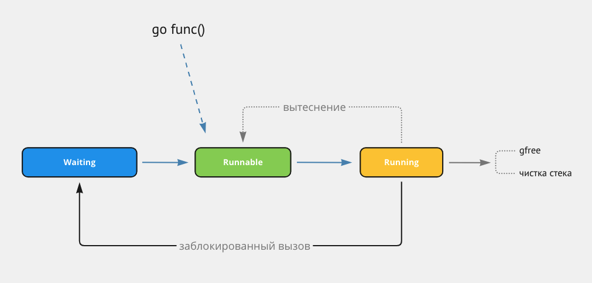
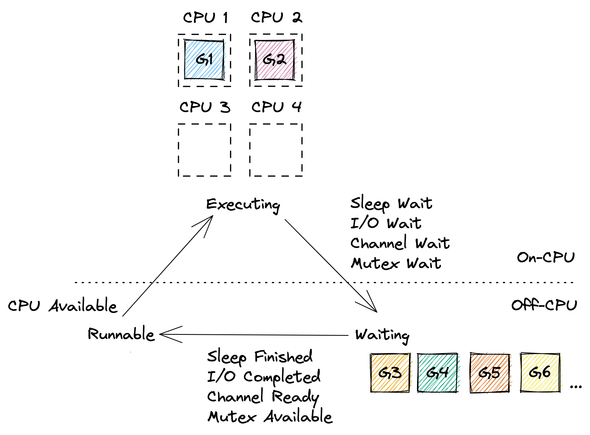
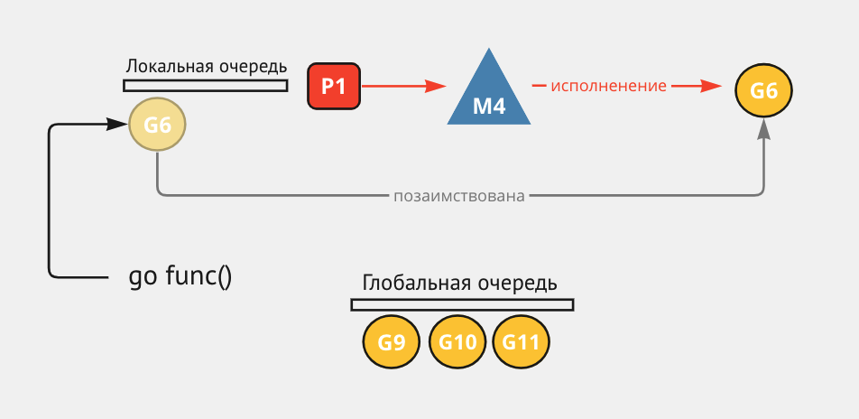
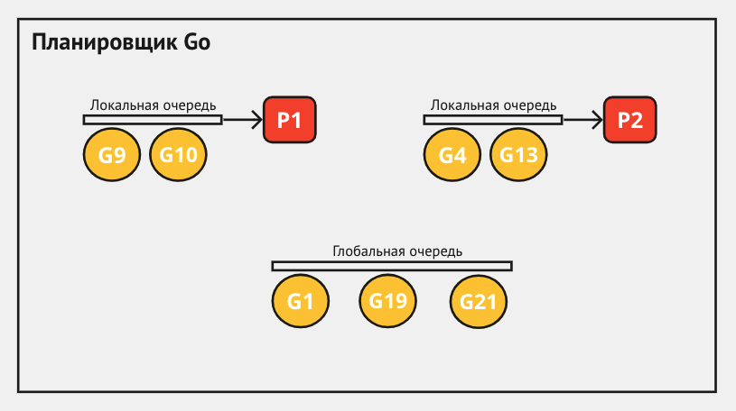
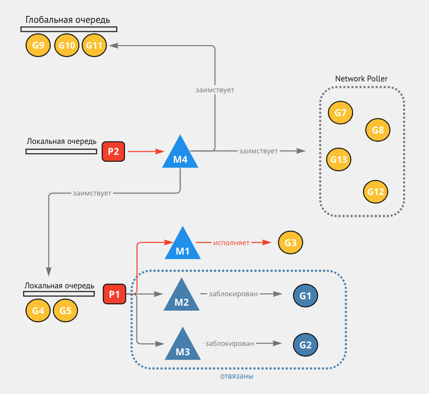
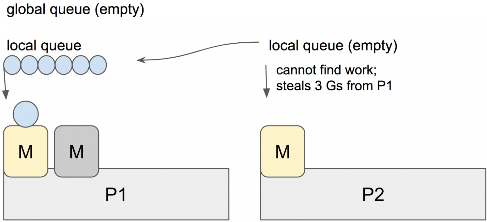
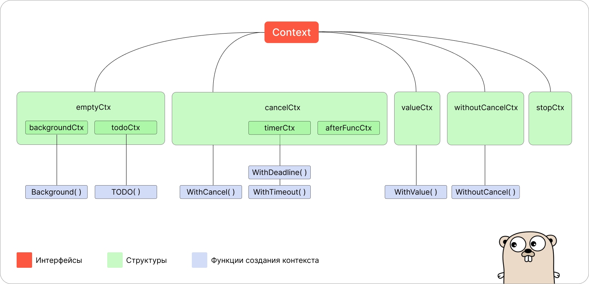

[CHEETSHEET](https://devhints.io/go)
[NUANCES](https://habr.com/ru/companies/vk/articles/314804/)
1. Go - декларативный ЯП. Нужно явно описывать что ты хочешь видеть от программы. Императивные ЯП (SQL, DOCKER)
// ООП
- какие концепции реализуются
- что такое утиная типизация
// new, make и другие ключевые слова defer select recover()

Defer - функция отложенного вызова. 
- Выполняется всегда (даже в случае паники внутри функции вызываемой)
- Часто используется для освобождения ресурсов/снятия блокировок
- несколько defer в функции выполняются в обратном порядке их вызову.

Init - Она выделяет фрагмент кода, который должен выполняться перед всеми другими частями пакета. 
- Этот код будет выполняться сразу после импорта пакета.
- можно использовать неоднократно в рамках даже одного файла. выполняться они будут в этом случае в порядке, как их встречает компилятор.

For/select


Что такое сериализация? Зачем она нужна?

Сериализация — это процесс преобразования объекта в поток байтов для сохранения или передачи. Обратной операцией является десериализация (т.е. восстановление объекта/структуры из последовательности байтов). Синонимом можно считать термин "маршалинг" (от англ. marshal — упорядочивать).
Из минусов сериализации можно выделить нарушение инкапсуляции, т.е. после сериализации "приватные" свойства структур могут быть доступны для изменения.
Типичными примерами сериализации в Go являются преобразование структур в json-объекты. Кроме json существуют различные кодеки типа MessagePack, CBOR и т.д.

Сколько можно возвращать значений из функции?
Теоретически, неограниченное количество значений, но лучше не больше 4:
- Последним значением возвращать ошибку, если её возврат подразумевается
- Первым значением возвращать контекст, если он подразумевается
- Если возвращается ошибка, то остальные значения возвращать нулевыми или nil

# Типы, устройство и работа с типами

##### Базовые типы:
1. Булевы (Boolean) типы:
    - `bool`
2. Целочисленные типы:
    - Знаковые: `int`, `int8`, `int16`, `int32`, `int64`
    - Беззнаковые: `uint`, `uint8` (эквивалент byte), `uint16`, `uint32`, `uint64`
    - Специальные целые: `uintptr` (используется для хранения указателей)
3. Числа с плавающей точкой (Floating-point) типы:
    - `float32`, `float64`
4. Комплексные типы:
   - `complex64` (составлен из float32), `complex128` (составлен из float64)
5. Символьный (Character) тип:
    - `rune` (эквивалент `int32`, используется для хранения Unicode)
##### Составные типы:
6. Строки - `string` (неизменяемая последовательность байт)
7. Массивы - `array` (фиксированная длина, элементы одного типа)
8. Срезы - `[]*T // slice` (динамическая последовательность, является ссылкой на массив)
9. Карты (Map) - `map[KeyType]ValueType` (ассоциативный массив или словарь)
10. Структуры - `struct` (набор полей с именами, аналог записей или классов без методов)
11. Интерфейсы - `interface` (набор методов, которые может реализовать тип)
##### Ссылочные типы:
12. Указатели - `*Type` (содержит адрес переменной определенного типа)
##### Функции:
13. Функции - `func` (определяет сигнатуру функции)
- Поведение при передаче в функцию: по умолчанию всегда используется копирование, т.е. передача по значению. Для передачи по указателю необходимо это явно указывать
##### Каналы:
14. Каналы - `chan Type` (используются для передачи данных между goroutines)

- Изменяемые объекты Go:
  - массивы и срезы 
  - Карты 
  - Каналы 
  - замыкания, которые захватывают по крайней мере 1 переменную из внешней области видимости
  - структуры (?)
- Неизменяемые объекты Go:
  - интерфейсы 
  - логические значения, числовые значения (включая значения типа int)
  - строки 
  - указатели 
  - указатели на функции и замыкания, которые могут быть сведены к указателям на функции
  структуры с одним полем

#### Приведение типа
```go
i := 2
f := float64(i)
u := uint(i)
```

# Строки и руны

<details>
<summary>Q/a</summary>

- изменяема ли строка
- что такое руны
///
- почему строки в го иммутабельны
- если иммутабельны, можно ли изменить символ
- как происходит конкатенация
- что такое руна
- как посчитать количество символов в строке
- в чем разница между проходом по строке индексом или рэнжом
</details>

Строка - простая последовательность байтов.
- Для создания строки в Golang используется двойные кавычки.
- не могут быть nil
Rune - юникодные символы. Это целое число типа int32, которое представляет отдельный символ.
- Для создания руны в Golang используется одинарные кавычки.
- В отличие от байтовых строк, руны могут быть изменены непосредственно в строке.

Строки неизменяемы. Напрямую изменить нельзя, можно сделать это через преобразование в руну:
```go
s := "hello"
runes := []rune(s) // Преобразование строки в массив рун
runes[0] = 'H'     // Изменение руны
s = string(runes)
```

Конкатенация (да и вообще любая операция со строкой) создает новую строку. Для частой конкатенации стоит использовать `strings.Builder`, чтобы избежать частого копирования.
```go
var builder strings.Builder
builder.WriteString("Hello")
builder.WriteString(" ")
builder.WriteString("World")
finalString := builder.String()
```

Подсчет длины:
- простой `len(s)` дает количество байт, а не символов
- для установления длины строки нужно:
  ```go
   import "unicode/utf8"
   
   length := utf8.RuneCountInString("текст") // Вернёт количество символов
   ```

##### Разница между проходом по строке индексом или с помощью range:
- [ПРИМЕР](https://goplay.space/#VBYoEp1ctuw)
- Проход индексом: Возвращает байты строки, что может быть неуместно для многобайтовых символов Unicode.
```go
for i := 0; i < len(s); i++ {
   b := s[i] // Байтовое представление, не символ (тут может весь символ вроде как не поместиться)
}
```


- Проход с помощью range: Корректно обрабатывает руны, даже если они занимают несколько байт. Возвращает индекс и руну (символ) на каждой итерации.
```go
for i, r := range s {
   // 'i' - индекс первого байта руны
   // 'r' - руна (int32)
   // можно обработать с помощью string(r)
}
```


# Массивы и слайсы
<details>
<summary>Q/a</summary>

- работа с массивами
- len
- capacity
- append, с каким коэффициентом увеличивается
- как слайс передается в функцию, по ссылке или по значению
- функция copy() как работает, есть ли подводные камни

/// 
- в чем отличие слайса от массива
- как устроен слайс
   - какая стратегия динамического расширения
- что будет происходить если:
   - читать из nil слайс
   - писать в nil слайс
</details>

### Массивы
Массивы в Go — это коллекции элементов одного типа, длина которых не может изменяться.
   - `arr := [4]int{3,2,5,4}`
   - ```go
      a := [3]int{}
      b := [2]int{}
      
      // (a) [2]int и (b) [3]int - разные типы
     
     a := [...]int{1, 2, 3} // [3]int - компилятор сам посчитает длину
      ```
     - передается по значению, не по ссылке: (в отличие от слайсов)
       - если мы передадим наш массив в функцию, то Go скопирует данный массив и в функции будет находиться уже совершенно другой массив (вернее точная копия исходного массива)
       - ```go
           package main
         
           import "fmt"
         
           func main() {
                var initArray = [...]int{1, 2, 3}
                var copyArray = initArray
                fmt.Printf("Address of initArray: %p\n", &initArray)
                fmt.Printf("Address of copyArray: %p\n", &copyArray)
           }
           /*
           Output:
           Address of initArray: 0xc00001a018
           Address of copyArray: 0xc00001a030
           */
           ```

### Слайсы
Слайсы в Go — это более гибкие массивы, которые позволяют изменять свою длину. 
   - Они являются надмножеством массивов и позволяют создавать массив, которым можно пользоваться как обычным массивом, расширяя его при необходимости.
   - ```go
      // С помощью make
      var foo []byte
      s := make([]byte, 5, 5) // указывается len и cap
      d := make([]byte, 5) // указывается len - в этом случае cap == len и при добавлении еще элемента мы получим копирование всего массива в новое место
	  foo = make([]int, 5, 4) // такой код не скомпилируется cap не может быть меньше реального len
      
      // С помощью shorthand syntax
      bar := []byte{}
      ```
   - если мы создадим слайс с cap=10 и поместим туда 5 элементов, а потом добавим еще один, то адрес массива не изменится.
   - если слайс переполняется, то капасити увеличивается в 2 раза (до 512 - потом будет не в 2 раза - 848-1280 и тд) [ПРИМЕР](https://goplay.space/#8hcqrsiMWHC)
     - `If the original slice capacity is less than 1024, the new slice capacity will be doubled`
     - `If the original slice capacity is greater than or equal to 1024, the new slice capacity will be expanded by 1.25 times`
   - передаются в функцию по ссылке (не по значению):
     - ```go
        package main
      
        import "fmt"
      
        func main() {  
        x := []int{1,2,3}
      
            func(arr []int) {
                arr[0] = 7
                fmt.Println(arr) // выводит [7 2 3]
            }(x)
      
            fmt.Println(x) // выводит [7 2 3]
        }
        ```

**!**`for v := range x` выводит не значение, а индекс. Верное использование `for _, v := range x`

Full slice expressions - `a[low:high:max]` - короткая запись получения подслайса
- создает срез длиной `high-low` и емкостью `max-low`. Используется крайне редко.
- где `low` - индекс первого элемента
- `high` - индекс последнего элемента не включительно
- `max` - capacity для нового слайса
```go
arr := [5]int{1, 2, 3} // [1 2 3 0 0]

s := arr[0:3:3] // [1 2 3]

len(s) // 3
cap(s) // 3

s = append(s, 4) // добавление нового элемента создаст новый массив
fmt.Println(arr) // [1 2 3 0 0]
fmt.Println(s) // [1 2 3 4]
```
а вот так исходный массив изменится
```go
arr := [5]int{1, 2, 3} // [1 2 3 0 0]

	s := arr[0:3:4] // [1 2 3]

	fmt.Println(len(s), cap(s)) // [1 2 3] 3 4

	s = append(s, 4) // добавление нового элемента НЕ создаст новый массив и изменит исходный
	fmt.Println(arr) // [1 2 3 4 0]
	fmt.Println(s)   // [1 2 3 4]
```

**В go 1.22 добавили создание уникального экземпляра для каждой итерационной переменной в каждой итерации цикла**
Это значит что не нужно переприсваивать переменную в цикле для создания уникального экземпляра и работы с ней

##### Слайс под капотом
Является структурой, которая содержит ссылку на исходный массив, длину и вместимость
```go
struct {
	array *[]T
	length int
	capacity int
}
```
- Поскольку слайс ссылается на часть массива, мы можем срезать часть массива. 
  - Срез не копирует элементы массива, он просто ссылается на них. Таким образом при изменении среза, изменится и массив, с которого мы брали срез:
  - ```go
      package main
      
      import "fmt"
      
      func main() {
         nameArray := [6]string{"D", "a", "n", "i", "i", "l"}
         nameSlice := nameArray[:3]
         nameSlice[len(nameSlice) - 1] = "m"
         fmt.Println(nameSlice) // [D a m]
         fmt.Println(nameArray) // [D a m i i l]
      }
      ```

### Copy и Append под капотом
`append()` - делает простую операцию — добавляет элементы в слайс и возвращает новый. [git](https://github.com/golang/go/blob/36b81acfa19d9fedf6a0cd60c394fd7a7703834e/src/runtime/slice.go#L188-L211)
- Мы просто передаем саму переменную (не ссылку). Функция не создает новый слайс, а принимает его.
- Append наоборот решает когда ему создавать новый слайс.
- не модифицирует а возвращает новый слайс, а `sort()` модифицирует порядок элементов, если он изначально был не отсортирован.

```go
foo := []int {1, 2}
bar := []int {}
copy(bar, foo)
```
под капотом копирование это:
```go
func copy(to []T, from []T) {
	for i := range from {
		to[i] = from[i]
	}
}
```

##### Дефолтное значение и операции над слайсом
- дефолтное значение - `nil`
- Обратите внимание, что нарезка nil среза приводит к получению nil среза, нарезка не-nil среза приводит к получению не-nil среза
- Преобразование не-nil среза в указатель массива приведет к получению не-nil указателя, преобразование nil среза в указатель массива приведет к получению nil указателя.
- ```go
   var s1 []int         // nil slice
   s2 := []int{}        // non-nil, empty slice
   s3 := make([]int, 0) // non-nil, empty slice
   
   fmt.Println("s1", len(s1), cap(s1), s1 == nil, s1[:], s1[:] == nil)
   fmt.Println("s2", len(s2), cap(s2), s2 == nil, s2[:], s2[:] == nil)
   fmt.Println("s3", len(s3), cap(s3), s3 == nil, s3[:], s3[:] == nil)
   
   for range s1 {}
   for range s2 {}
   for range s3 {}
  
   // s1 0 0 true [] true
   // s2 0 0 false [] false
   // s3 0 0 false [] false
   ```
  ```go
  append([]string(nil), "")  // инициализирует slice пустым значением. != nil. len & cap == 1
  append([]string(nil), []string(nil)...) // slice == nil, len & cap == 0
  range append([]string(nil), []string(nil)...) // в range не войдет, т.к. размер слайса == 0
  ```
- итерация по всем вариантам массива и append работает как надо [EXAMPLE](https://goplay.space/#eRlLbYlTFqM)
```go
func main() {
	var s1 []int         // nil slice
	s2 := []int{}        // non-nil, empty slice
	s3 := make([]int, 0) // non-nil, empty slice

	for range s1 {
	}
	for range s2 {
	}
	for range s3 {
	}

	s1 = append(s1, 1)
	s2 = append(s2, 2)
	s3 = append(s3, 3)
	fmt.Println(s1, s2, s3) // [1] [2] [3]
}
```

# Мапы [[link]](https://habr.com/ru/companies/avito/articles/774618/)
<details>
<summary>Q/a</summary>

- работа мап под капотом
- сложность
- что может быть ключом мапы
- порядок обхода
- что такое бакеты, экстра бакет
- коллизии, что происходит когда много коллизий
- эвакуация
- нельзя присваивать в nil слайс

///
- что такое хэш
- что такое хэш-таблица
- что такое коллизия
- что такое лоад фактор
- как происходит реиндексация
- что будет происходить если:
  - читать из nil мап (можно - будет default значение) https://goplay.space/#j3AOVMgCadh
  - писать в nil мапу (нельзя паника)
  - Обращение к несуществующим ключам в map ()  - дефолтное значение, но можно проверить есть ли там ключ через var, ok := m["key"]
  - итерироваться по nil мапе (можно) https://goplay.space/#pBk9inM6-Id
  - в мапе можно указывать cap в mp := make(map[int]int, 100), но вызывать cap(m) нельзя - ошибка компилирования
</details>

Карта (`map` или `hashmap`) — это неупорядоченная коллекция пар вида ключ-значение.
`type myMap map[string]int`

Инициализация только так:
```go
first := map[int]int{}

length := 5
second := make(map[int]int, length)

var third map[int]int // запись в такую мапу даст панику.
```

Особенности:
- читать из nil мап (можно - будет default значение) https://goplay.space/#j3AOVMgCadh
- Но если писать в nil map то словим панику.
  - по идеологии го все структурные типы должны быть инициализорованы, чтобы писать в них.
- Обращение к несуществующим ключам в `map`  - дефолтное значение
  - `val, ok := people["Tom"]` - краткая проверка что значение есть в мапе (получаем флаг который можем обработать в коде)
- итерироваться по nil мапе (можно) https://goplay.space/#pBk9inM6-Id
  - Порядок перебора всегда условно случаен
- Адрес элемента мапы получить невозможно(сделано из-за того что адрес может стать недействителен, после рехеширования):
  ```go
      _ = &ages["bob"] // ТАК НЕЛЬЗЯ!!!
  ```
- У мапы есть `len` но нет `cap`. У нас есть только `overflow` который указывает "куда-то" когда мапа переполняется, и поэтому у нас не может быть `capacity`.
  - в мапе можно указывать cap в mp := make(map[int]int, 100), но вызывать cap(m) нельзя - ошибка компилирования
- Ключ у мапы может быть только `comparable`.
  - булевы, числовые, строковые, указатели, канальные и интерфейсные типы, а также структуры или массивы, содержащие только простые типы.
  - Слайсы, мапы и функции использовать нельзя, так как эти типы не сравнить с помощью оператора `==` или `!=`
- **Мапы всегда передаются по ссылке**

## Связанные понятия
**Хэш** - числовое значение полученное на выходе хэш функции
**Хэш-функция** - функция, получающая значение(строку, byte slice) и возвращает значение фиксированной длины
- определяет, в каком "bucket" (или "корзине") будет храниться значение.
**Load factor в хеш-таблице** — это отношение количества элементов, хранящихся в хеш-таблице, к размеру базового массива (числу buckets).
- Он определяет, насколько заполнена хеш-таблица, и может значительно влиять на производительность операций с хеш-таблицей. 
- Например, если в хеш-таблице 10 элементов, а размер массива — 20, то load factor будет равен 0,5 == (10 / 20)
**Bucket** - содержит несколько пар ключ-значение, которые имеют один и тот же или близкий хеш.
**Коллизия** - ситуация когда для двух разных значений поданных на вход хэш функции сопоставлен идентичное значение хэша.
- Коллизии в хеш-таблице (когда два ключа дают одинаковый хеш) решаются с помощью метода цепочек, где каждый элемент в бакете содержит указатель на следующий элемент с тем же хешем. 
- Это позволяет нескольким элементам быть связанными в одном бакете.

## Внутреннее устройство

мапа в Go — это просто указатель на структуру `hmap`:
```go
type hmap struct {
    // Note: the format of the hmap is also encoded in cmd/compile/internal/reflectdata/reflect.go.
    // Make sure this stays in sync with the compiler's definition.
    count     int // # live cells == size of map.  Must be first (used by len() builtin)
    flags     uint8
    B         uint8  // log_2 of # of buckets (can hold up to loadFactor * 2^B items)
    noverflow uint16 // approximate number of overflow buckets; see incrnoverflow for details
    hash0     uint32 // hash seed

    buckets    unsafe.Pointer // array of 2^B Buckets. may be nil if count==0.
    oldbuckets unsafe.Pointer // previous bucket array of half the size, non-nil only when growing
    nevacuate  uintptr        // progress counter for evacuation (buckets less than this have been evacuated)

    extra *mapextra // optional fields
}
```
мапа содержит:
- Количество элементов
- Количество "ведер" (представлено в виде логарифма для ускорения вычислений)
- Seed для рандомизации хэшей (чтобы было сложнее заddosить — попытаться подобрать ключи так, что будут сплошные коллизии)
- Всякие служебные поля и главное указатель на `buckets`, где хранятся значения

## Как растут мапы / эвакуация (перехеширование)
**Maximum average load of a bucket that triggers growth is 6.5** - строка в исходном коде
- То есть, если в каждом "ведре" в среднем более 6,5 элементов, происходит увеличение массива `buckets`.
- При этом выделяется массив в **2 раза больше**, а старые данные копируются в него маленькими порциями каждые вставку или удаление, чтобы не создавать очень крупные задержки.
  - элементы распределяются заново среди нового, большего количества корзин.
- Поэтому все операции будут чуть медленнее в процессе **эвакуации данных**.
  - при поиске тоже, нам же приходится искать в двух местах
  - После успешной эвакуации начинают использоваться новые данные.

**Из-за эвакуации данных нельзя и взять адрес мапы**
**Чтобы не было эвакуаций и чтобы более стабильно работала программа без использования лишнего процессорного времени лучше всего указывать capacity мапы заранее, чтобы выделить под нее память.**
- `make(map[int]int, length)`

## Потокобезопасность мапы / race condition
Стандартная мапа **не является потокобезопасной**. Для обеспечения безопасности обычно строится такая структура с `RWmutex`:
```go
type ProtectedIntMap struct {
    mx sync.RWMutex
    m  map[string]int
}

func (m *ProtectedIntMap) Load(key string) (val int, ok bool) {
    m.mx.RLock()
    val, ok = m.m[key]
    m.mx.RUnlock()

    return
}

func (m *ProtectedIntMap) Store(key string, value int) {
    m.mx.Lock()
    m.m[key] = value
    m.mx.Unlock()
}
```

Также можно использовать потокобезопасную `sync.Map` построенную на атомиках. Но в большинстве случаев она работает медленнее. 
Кроме проблемы `cache contention`, которую она благополучно решает.

# Интерфейсы
[Habr 1](https://habr.com/ru/articles/597461/)
[Habr 2](https://habr.com/ru/articles/276981/)
<details>
<summary>Q/a</summary>

- type assertion
- что из себя представляет интерфейс (состоит из типа и значения)
- сравнение интерфейса с nil
- как привести тип одного интерфейса к другому
- как проверить тип интерфейса
- что такое пустые интерфейсы
- неочевидные кейсы
</details>

**A type implements an interface by implementing its methods**
Это называется утиной типизацией:
- Если наш тип реализует все методы интерфейса, значит он реализует этот интерфейс. 
- Если что-то крякает как утка, бегает как утка, летает как утка - то это утка.

**пустой интерфейс в Go**: `interface{}` - не описывает методы, у него нет правил. Любой объект удовлетворяет пустому интерфейсу.
**чем больше интерфейс, тем слабее абстракция**

##### Под капотом интерфейс состоит из типа и значения
```go
type iface struct {
    tab  *itab   
    data unsafe.Pointer
}
```
Где:
- `tab` - тут у нас хранится информация о конкретном типе объекта, который был преобразован в интерфейс 
  - по сути указатель на `itable` - структуру, которая хранит некоторые метаданные о типе и списке объектов, используемых для удовлетворения интерфейса.
- `data` - ссылка на реальную область памяти, в которой лежат данные изначального объекта (указывает на фактическую переменную с конкретным (статическим) типом)

**ВАЖНО**
**переменная интерфейсного типа может принимать nil.**
Но так как объект интерфейса в Go содержит два поля: `tab` и `data` — по правилам Go, интерфейс может быть равен `nil` только если оба этих поля не определены
```go
var (
    builder  *strings.Builder
    stringer fmt.Stringer
)

fmt.Println(builder, stringer) // nil nil
fmt.Println(stringer == nil)   // true
fmt.Println(builder == nil)    // true

stringer = builder

fmt.Println(builder, stringer) // nil nil
fmt.Println(stringer == nil)   // false (!!!)
fmt.Println(builder == nil)    // true
```

**!** По умолчанию описывать интерфейсы следует на принимающей стороне — таким образом, ваш код будет меньше зависеть от какого-то другого кода/пакета/реализации.
Так принимающая сторона не будет ничего знать о том, что именно в неё может "прилететь", но точно знает поведение этого "чего-то".

##### Type assertion и type switch
**Type assertion** - позволяет преобразовать объект интерфейса обратно к исходному типу. Это безопасный механизм, дающий проверить.
- `m, ok := worker.(Man)`, если не использовать `ok`, то получим панику, если в интерфейсе окажется несоответствующий тип

**Type Switch**
[Переключатель типов](https://tour.golang.org/methods/16) сравнивает типы, а не значения. Выглядит как несколько type assertion подряд.

```go
switch v := i.(type) {
case T:
    // here v has type T
case S:
    // here v has type S
default:
    // no match; here v has the same type as i
}
```  

##### Нюансы с nil
**The value of an uninitialized variable of interface type is nil** Это означает, что переменная интерфейсного типа может принимать nil.
А что если попробовать преобразовать пустую переменную к интерфейсу - при проверке на nil она больше никогда не будет nil.
```go
func main() {
   var man *Man
   fmt.Printf("%#v\n", man) // (*main.Man)(nil)
   var worker Programmer
   fmt.Printf("%#v\n", worker) // <nil>
   
   worker = man
   fmt.Printf("%#v\n", worker) // (*main.Man)(nil)
   // наш воркер изменил тип, он больше не совсем nil,
   // а nil от типа *main.Man
   // что же это для нас значит, давайте смотреть
   
   fmt.Printf("%t\n", man == nil) // true
   // отлично, наш man равен nil,
   // мы же туда ничего не положили и ссылка равна nil
   fmt.Printf("%t\n", worker == man) // true
   // ну тоже хорошо, мы положили в переменную
   // worker переменную man,
   // и как мы уже убеждались ранее, они равны
   
   // ну и понятно, по законам математики,
   // если x = 0, а y = x, значит y = 0
   fmt.Printf("%t\n", worker == nil) // false
   // а вот и нет, это вам Go, а не математика
   fmt.Printf("%s\n", reflect.ValueOf(worker).Elem())
   // <invalid reflect.Value>
   // после присвоения переменной worker переменной man
   // мы точно также не можем получить значение через reflect
   // так как man у нас не содержит каких-либо данных, он равен `nil`
   fmt.Printf("%v\n", reflect.TypeOf(worker)) // *main.Man
   // а вот с типом интереснее мы из переменной worker
   // получили тип переменной man, то есть *main.Man
   // соответственно поле `tab` у нашего интерфейса уже явно не пустое
   // и поэтому переменная worker больше не будет равна nil
}
```

##### Кто и когда должен создавать интерфейс?
- **Интерфейс создается потребителем (consumer), а не продюсером (producer).**

### Самые популярные интерфейсы в стандартной либе:
- Stringer
- Error
- io.Writer
- io.Reader
- io.Closer
- io.ReadWriter
- Marsheller
- Unmarshaller
- ByteReader
- ByteWriter
- context.Context


# Структуры

**Структура хранит данные, но не поведение. Интерфейс хранит поведение, но не данные.**
##### Выравнивание
- это крайне полезный для ускорения работы процессора механизм
- в больших структурах он способен раздуть их намного больше необходимого
- <details>
   <summary>сортируйте поля в структурах по размеру</summary>

   ```go
   type alignmentStruct12 struct {
       b1 byte
       i  uint32
       b2 byte
   }
   
   func main() {
       x := alignmentStruct12{
           b1: util.MaxByte,
           i:  util.MaxUint32,
           b2: util.MaxByte,
       }
   
       fmt.Println(unsafe.Sizeof(x)) // 12
       fmt.Println(*(*[12]byte)(unsafe.Pointer(&x))) // [255 0 0 0 255 255 255 255 255 0 0 0]
       // фрагментация структуры, равна 50% - это очень много (6 лишних нулей показывают выравнивание)
   }
   ```
  Для выравнивания достаточно просто поменять местами поля в структуре: так, чтобы маленькие однобайтовые поля были в начале 
   ```go
   type alignmentStruct8 struct {
       b1 byte
       b2 byte
       i  uint32
   }
  
  // тогда получим:
  // 8
  // [255 255 0 0 255 255 255 255]
  ```
   </details>
  
   - не важен порядок: по убыванию или возрастанию (чаще по убыванию)
   - не стоит злоупотреблять, потому что очень сильно бьет по читаемости.

# Указатели
- `&`- оператор адреса и определяет адрес переменной в памяти
- `*` - оператор разыменования и используется для:
  - объявления переменной-указателя
  - доступа к значениям, сохранённым по адресу

**В Go ссылок нет — есть только указатели**
- Это означает, что данные лежат по одному адресу, а указатель на них — по другому. 
  - <details>
      <summary>
    Если передать указатель в функцию, передана будет копия указателя и у нее будет совсем другой адрес. Но внутри адрес будет точно такой же, как и у изначального указателя
      </summary>

     ```go
      package main
      
      import (
         "fmt"
         "unsafe"
      )
      
      func main() {
         x := 123
         
         fmt.Println("pointer in main", &x)
         p := pointTest(&x)
         fmt.Println(x)
         fmt.Println("Distance main to func:", uintptr(unsafe.Pointer(&x))-p)
      }
      
      // go:noinline
      func pointTest(t *int) uintptr {
         fmt.Println("pointer of t", &t)
         fmt.Println("pointer in func before", t)
         z := 321
         t = &z
         fmt.Println("pointer in func after", t)
         return uintptr(unsafe.Pointer(&t))
      }
     
      // pointer in main 0xc00009a000
      // pointer of t 0xc000092020
      // pointer in func before 0xc00009a000
      // pointer in func after 0xc00009a008
      // 123
      // Distance main to func: 32736
      ```
     </details>

- Указатель на указатель: `**int`
  - так как указатель на определенное значение где-то хранится в отдельной ячейке памяти, то мы можем взять указатель на указатеь:
  - он покажет, где находится указатель в памяти, который ссылается на какую-то структуру.
  ```go
   package main
   
   import "fmt"
   
   func main() {
       var v int = 100
       var pt1 *int = &v
       var pt2 **int = &pt1
     
       fmt.Println("The Value of Variable v is = ", v)  // 100
     
       *pt1 = 200
       fmt.Println("Value stored in v after changing pt1 = ", v) // 200
     
       **pt2 = 300
       fmt.Println("Value stored in v after changing pt2 = ", v)  // 300
   }
   ```

# Каналы
<details>
<summary>Q/a</summary>

- буферизованные/небуферизованные
- аксиомы каналов
- Что будет с циклом range когда канал буферизированный?
  ///
- как внутри устроен кольцевой буфер
- какие есть очереди внутри и какую роль они играют
- паттерны использования каналов
  - pipe, finin, finout
- что будет если два раза закрыть канал - panic: close of closed channel
</details>

**Каналы в Go — это объекты связи, с помощью которых горутины обмениваются данными**

### Виды каналов:
- Буферизированные
  - Запись в буферизированный канал не является блокирующей операцией до тех пор, пока не заполнится буфер канала.
    - После переполнения буфера - вызовет блокировку
  - Чтение из буферизированного канала не является блокирующим, если буфер канала не пуст
    - При пустом буфере канала чтение из него вызовет блокировку
  - Чтение из буферизированного канала - жадная операция. 
    - Если начался процесс чтения данных из канала, то данные будут читаться без блокировки до момента опустошения буфера.
- Небуферизированные
  - Чтение из пустого и запись в непустой небуферизированный канал являются блокирующими операциями.

У канала можно взять операцию 'len()' и 'cap()' - вернет количество элементов в буфере и сам капасити

При получении данных из канала можно проверить был ли он закрыт так: `value, ok := <-ch`

### Важные аспекты
- канал создается с помощью ключевого слова `chan`
  ```go
    package main
    
    import "fmt"
    
    func main() {
        var c chan int
        fmt.Println(c)      // nil
        // c <- 5           // deadlock - нельзя писать и читать в одной и то
        // fmt.Println(<-c) // deadlock - канал не создан через make
        // close(c)         // panic нельзя закрыть уже закрытый или nil канал
    }
    
    ```

- **4 аксиомы каналов**
  - A send to a nil channel blocks forever
  - A receive from a nil channel blocks forever
  - A send to a closed channel panics
  - A receive from a closed channel returns the zero value immediately (или значение из буфера если оно еще есть)
- **Еще нюансы:**
  - нельзя закрыть уже закрытый канал - будет паника
  - нельзя закрыть `nil` канал - будет panic
  - нельзя писать и читать в/из `nil` `chan` - будет deadlock 

При закрытии канала Go проходит по всем ожидающим на чтение или запись горутинам и разблокирует их. Все получатели получают дефолтные значение переменных того типа данных канала, а все отправители паникуют.

Используя буферизованный канал и цикл for range, мы можем читать с закрытых каналов. 
Поскольку у закрытых каналов данные все еще живут в буфере, их можно считать:
```go
package main

import "fmt"

func main() {
    c := make(chan int, 3)
    c <- 1
    c <- 2
    c <- 3
    close(c)

    // iteration terminates after receiving 3 values
    for elem := range c {
        fmt.Println(elem)
    }
}

// или так:
func readChan() {
  for {
    if val, ok := <-c; ok {
      println(val)
    } else {
      break
    }
  }
}
```

Существует синтаксический сахар однонаправленных каналов (улучшает безопасность типов в программe, что, как следствие, порождает меньше ошибок)
```go
c := make(<-chan int) // только для чтения
c := make(chan<- int) // только для записи
```

### select/case
Оператор `select` позволяет читать "одновременно" из нескольких каналов
- является блокируемым, за исключением использования секции `default`
- в случае, если в оба канала одновременно придут сообщения (или они уже там были), то `case` будет выбран случайно (а не по порядку их объявления, как могло бы показаться).
- Если ни один из каналов недоступен для взаимодействия, и секция `default` отсутствует, то текущая горутина переходит в состояние `waiting` до тех пор, пока какой-то из каналов не станет доступен.
- Если в `select` указан `default`, то он будет выбран в том случае, если все каналы не имеют сообщений, **таким образом `select` перестает быть блокируемым**.

### Интересность с горутинами и кольцевой буффер [[link]](https://backendinterview.ru/goLang/concurrency/chanel.html)
Структура канала:
```go
type hchan struct {
   qcount   uint           // количество элементов в буфере
   dataqsiz uint           // размерность буфера для буферизированного канала
   buf      unsafe.Pointer //  ссылка на буфер с данными, записанными в канал, реализованный с помощью структуры данных “кольцевой буфер”
   elemsize uint16 // размер одного элемента в канале
   closed   uint32 // закрыт или открыт канал в данный момент(из за работы с atomic не bool а uint32)
   elemtype *_type // ссылка на тип данных в канале
   sendx    uint   // индекс смещения записи - в какой  элемент буфера будет следующая запись
   recvx    uint   // индекс смещения чтения - с какого элемента буфера будет следующее чтение
   recvq    waitq  // очередь заблокированных горутин(sudog), ожидающие чтения
   sendq    waitq  // очердь заблокированных горутин(sudog), ожидающие записи
   lock mutex  // мьютекс, используемый для операций, изменяющих состояние канала
}
```
- **!!!** В общем случае, горутина захватывает `lock mutex`, когда совершает какое-либо действие с каналом, кроме случаев lock-free проверок при неблокирующих вызовах(например при использовании `select`).
- `Closed` — это флаг, который устанавливается в 1, если канал закрыт, и в 0, если не закрыт.
- Как видно канал содержит в себе очереди(`waitq` горутин(на чтение `recvq` и запись `sendq`)

  - `waitq` - это структура, которая содержит ссылки на первый и последний элемент списка из `sudog` горутин
  ```go
  type waitq struct {
      first *sudog
      last  *sudog
  }
  ```
  - `sudog` представляет заблокированную горутину, ожидающую чтения или записи
  ```go
  type sudog struct {
      g *g                    // ссылка на горутину
      elem     unsafe.Pointer // данные для записи
      // ...
  }
  ```
- При закрытии канала Go проходит по всем ожидающим на чтение или запись горутинам и разблокирует их. Все получатели получают дефолтные значение переменных того типа данных канала, а все отправители паникуют.

- у небуферизированных каналов структура `buf` равна `nil`
- если в очереди `sendq` нет ожидающих отправки горутин, то:
  - у небуферизированных каналов горутина добавит сама себя в `recvq` и заблокируется
  - у буферизированных - положит в буфер если есть место в буфере, а если нет то тоже самое что и в небуфиризированных.
  - при попытке прочитать значение из канала другой горутиной произойдет следующее:
    - Go гарантирует, что канал работает по принципу FIFO очереди (спецификация), но горутина не может просто взять значение из буфера и продолжить исполнение.
    - текущая горутина читает данные из буфера, затем добавляет значение из заблокированной горутины в буфер, разблокирует ожидающую горутину и удаляет её из очереди ожидания.
    - В случае же, если нет ожидающих горутину, она просто читает первое значение из буфера


### Паттерны использования каналов:
- **Fan-out**:
  - Распределение работы между несколькими горутинами, которые читают из одного канала.
- **Fan-in**:
  - Объединение результатов работы нескольких горутин в одном канале.
- **Pipe (pipeline)**:
  - используется для передачи данных через несколько стадий обработки. 
  - Каждая стадия получает данные из входного канала, обрабатывает их и передает в выходной канал.
- **Broadcast**
  - Один источник отправляет данные в несколько каналов.
- Timeout control**
  - Ограничивает время ожидания операции. 
  - Предотвращает бесконечное ожидание в случае задержек или сбоев, например, при запросах к внешним сервисам.
  - <details>
    
    <summary>
    Реализуется использованием select с каналом таймера для ограничения времени выполнения операции.
    </summary>
    
    ```go
    package main
  
    import (
       "fmt"
       "time"
    )
  
    func operation(ch chan<- string) {
       // Имитация длительной операции
       time.Sleep(2 * time.Second)
       ch <- "результат операции"
    }
  
    func main() {
       ch := make(chan string)
       go operation(ch)
  
       select {
       case res := <-ch:
          fmt.Println(res)
       case <-time.After(1 * time.Second):
          fmt.Println("Тайм-аут операции")
       }
    }
       ```
    </details>

# асинхронность и примитивы синхронизации
<details>
<summary>Q/a</summary>

- горутины
  - почему они легковесные
  - сравнение os thread
  - context switch
  - стек и где аллоцируется
  - куча
  - вытесняющая и кооперативная многозадачность
- шедулер
- устройство внутреннее горутин и как они вытесняются
- почему лучше os thread
- мьютексы, примитивы синхронизации, атомики
- дедлоки, паники и race condition, life lockи
- зачем нужна обычная синкмапа если обычную мапу можно обернуть в мьютекс
  /// рассказать
  // горутины
- что такое сопрограмма, корутины, горутины и тд
- преимущества использования сопрограмм
- контекст горутины
- в чем разница контекст свитчинга
- что такое мьютекс, как он работает
- что происходит с горутиной когда она вызывает метод lock
  // планировщик
- вытесняющая и кооперативная многозадачность (модели)
- какую модель использует голанг
- что такое GMP модель, что такое goroutine, machine, processor
- что такое глобальная очередь, что такое локальная очередь.
- что такое work steering, как горутины переходят из очереди в очередь
  - почему используется он, а не work sharing
- в какой момент горутины переключаются
- что такое netpoller и sysmon (видимо про различие сетевого вызова и какой-то работы внутри системы)
  - какую роль в планировщике они играют
- что происходит с горутиной в тот момент, когда она вызывает какой-то syscall
- сколько работает горутина по времени
</details>

## Горутины [[link]](https://habr.com/ru/articles/804145/)
**Горутина - это сопрограмма (как и корутина в Котлине и тд)**, по сути это блоки кода, которые работают асинхронно, то есть по очереди. Управляются планировщиком.
В нужный момент исполнение такого блока приостанавливается с сохранением всех его свойств, чтобы запустился другой код. Когда управление возвращается к первому блоку, он продолжает работу. В результате программа выполняет несколько функций одновременно.

- Горутина - легковесный поток, намного выгоднее работать с ними чем с системными тредами.
- Горутины очень легкие(примерно 4.5кб на горутину против нескольких мегабайт на поток POSIX)
- Горутины поддерживают высокую конкурентную нагрузку с низкими накладными расходами.
- Работают до ~10мс непрерывно.
  - Время измеряемое различными профилировщиками Go - это, по сути, время, которое горутины проводят в состояниях Executing и Waiting

### Состояния горутин:

Горутина может находиться в трех (основных) состояниях:
- **Waiting**
  - В этом состоянии, горутина бездействует. Например, встает на паузу для операции с каналами или блокировками, либо может быть остановлена системным вызовом.
- **Runnable** 
  - Горутина готова к тому, чтобы быть исполненной, но еще не исполняется. Она ожидает своей очереди на потоке (M).
- **Running**
  - Горутина исполняется на потоке (M). Это будет продолжаться, пока работа не будет выполнена, или до тех пор, пока ее не прервет планировщик, либо что‑то еще ее не заблокирует.


### Отличия горутин от потоков
- управление собственным шедулером, в отличие от **потоков, они планируются в ядре**.
  - Планировщик мультиплексирует /раскидывает горутины (m) по (n) потокам.
  - Основной плюс — это отсуствие оверхеда на переключение контекста.
- стэк и его размер
  - горутина стартует со стэка размеров всего 2 килобайта и может расти до 1гб, в отличие от OS threads
  - у потока он статичен и зависит от системы (от 2 до 10мб)
  - stack может и уменьшаться, если нужно, чего не сказать про OS Thread.
- gomaxproc
  - помогает определить сколько потоков операционной системы могут одновременно активно выполнять код
  - по умолчанию равно количеству процессоров компьютера, так что на машине с 8 процессорами планировщик будет планировать код Go для выполнения на 8 потоках одновременно
  - лучше всего менять значение единожды - на старте приложения. Если менять его в рантайме, это приведет к STW (stopTheWorld), все приложение встанет на паузу, пока изменяется количество процессоров.
- вызов lock и unlock у мьютексов:
  - Когда горутина вызывает Lock, если мьютекс заблокирован, горутина будет заблокирована до тех пор, пока другой поток не вызовет Unlock.

#### Stack
- Каждый поток операционной системы имеет блок памяти фиксированного размера (зачастую до 2 Мбайт) для стека — рабочей области, в которой он хранит локальные переменные вызовов функций, находящиеся в работе или приостановленные на время вызова другой функции. В противоположность этому go-подпрограмма начинает работу с небольшим стеком, обычно около 2 Кбайт. Стек go-подпрограммы, подобно стеку потока операционной системы, хранит локальные переменные активных и приостановленных функций, но, в отличие от потоков операционной системы, не является фиксированным; при необходимости он может расти и уменьшаться. Максимальный размер стека go-подпрограммы может быть около 1 Гбайта, на порядки больше типичного стека с фиксированным размером, хотя, конечно, такой большой стек могут использовать только несколько go-подпрограмм.
- Раньше использовался Segmented Stacks потом переделали на Сontiguous Stacks 
  - Segmented Stacks - выделяет память по кусочкам, из-за большого количества аллокаций в цикле могут быть проблемы
  - Сontiguous Stacks - когда нужно добавить места (работает как в слайсах) - выделяется стэк побольше и все что надо копируется в новый, а старый удаляется.
  - <details>
      <summary>Переход от Segmented Stacks к Contiguous Stacks в Go был вызван проблемой «горячего разделения» (hot split).</summary>

    - Если стек почти заполнен, вызов приводит к выделению нового фрагмента стека. Когда этот вызов возвращается, новый фрагмент стека высвобождается. Если один и тот же вызов происходит неоднократно в коротком цикле, накладные расходы на аллокацию/высвобождение будут ощутимыми.
    - В версии Go 1.3 проблему решили путём перехода на непрерывный стек (contiguous). Теперь при необходимости роста стека среда выполнения создаёт новый, несколько больший стек, копирует в него содержимое старого стека, настраивает все скопированные указатели на новые адреса и разрушает старый стек.

      </details>

Переход от Segmented Stacks к Contiguous Stacks в Go был вызван проблемой «горячего разделения» (hot split). 

#### Выделение памяти
Так как горутины являются ``stackful`` — то и память для них (их состояние) хранится на **стеке**. Поэтому, теоретически, если очень постараться и сделать миллиард вложенных вызовов, то можно сделать себе переполнение стека.
Для самих же переменных, что используются внутри горутин память берётся с **хипа** (ограничены только размером "физического" **хипа*, т.е. объемом оперативной памяти сколько есть на машине).
**ни одна горутина не может иметь указателя на стек другой горутины**

#### Вытесняющая и кооперативная многозадачность
Существует 2 типа многозадачности:
- **кооперативная** (так было до GO 1.14) — передачей управления процессы занимаются самостоятельно; 
  - планировщик спит пока одна из горутин явно не разбудит его с намеком о готовности отдать свое место другой.
  - Планировщик далее сам решит, надо ли убирать из контекста текущую горутину, и если да, кого поставить на ее место.
- **вытесняющая** (так стало в GO 1.14) — планировщик дает отработать процессам равное время, после чего переключает контекст.
  - Данный планировщик работает в фоне, выгружает потоки на основании различных эвристик, а вместо выгруженных процессорное время начинают получать другие потоки.

С версии Go 1.14 планировщик с кооперативного стал асинхронно вытесняющим.
Это произошло потому что в кооперативной многозадачности как только планировщик дает процессорное время горутине с бесконечным циклом, она всецело захватывает P, внутри этой горутины не происходит ни каких вызовов функций, а значит и планировщик мы больше не разбудим.

#### Context Switching (Переключение контекста)
Переключение между двумя Горутинами — супер дешевое, `O(1)`, то есть, не зависит от количества созданных горутин в системе. Всё, что нужно сделать для переключения, это поменять 3 регистра — `Program counter`, `Stack Pointer` и `DX`.

Переключение контекста между горутинами легче по сравнению с потоками, так как оно управляется собственным планировщиком Go (M:N планировкой), который очень эффективно распределяет задачи между несколькими системными потоками.
Может быть связано с:
- **Ожидание I/O операций:**
  - Когда горутина выполняет операцию ввода-вывода, например, чтение из файла или ожидание ответа сетевого запроса, она блокируется до завершения этой операции. В этот момент планировщик Go может переключиться на другую горутину, которая готова к выполнению.
- **Системные вызовы (sys call)**
  - Cистемные вызовы, которые могут занять значительное время, также приводят к переключению контекста.
- **Операции синхронизации:**
  - Горутины могут быть приостановлены при попытке доступа к ресурсу, который заблокирован другой горутиной (например, при использовании мьютексов или ожидании в каналах). Пока горутина ожидает разблокировки ресурса, планировщик может переключиться на выполнение других горутин.
- **runtime.Gosched():**
  - Можно явно вызвать функцию runtime.Gosched() в коде, чтобы уступить время процессора другим горутинам.
- **Долгие вычисления:**
  - Если горутина выполняет длительные вычислительные операции без каких-либо прерываний (~10мс), планировщик переключит контекст, чтобы предотвратить зависание других горутин.
- **Вызов функций, поддерживающих переключение контекста:**
  - Некоторые функции, такие как time.Sleep() или блокировка на канале, также могут привести к переключению контекста.

### Проблемы связанные с горутинами:
- deadlock - возникает, когда несколько горутин (параллельных потоков исполнения) заблокированы навечно, ожидая друг друга или другие ресурсы.
  - Это часто происходит, если горутины ждут чтения или записи от канала, который никогда не будет разрёжен.
- livelock - похож на deadlock, но отличается тем, что состояния горутин (или процессов) постоянно меняются, реагируя на изменения друг в друге, но не делая никакого прогресса.
- race condition (гонка) - это более общий термин для обозначения любой ситуации, где результат программы зависит от неконтролируемой последовательности или времени событий параллельного выполнения.
  - Как задетектить гонку? - Пишем тесты, и запускаем их с флагом `-race`
  - Если race detector обнаруживает состояние гонки, то оно у вас наверняка есть; если же не обнаруживает — то это не означает что его нет
- data race - частный случай race condition
  - это ситуация, когда переменная записывается одновременно с другими операциями чтения и записи этой переменной.
  - возникает, когда две или более горутины имеют доступ к общему ресурсу (например, переменной) и как минимум одна из них записывает в него, а порядок выполнения не определён.
- panic - аварийное завершение программы

## Шедулер (планировщик M:N)
<details>
<summary>
термины
</summary>

Конкурентность: Это о том чтобы несколько задач исполнялись одновременно, но не обязательно в один и тот же момент времени.
Параллельность: Это значит, что несколько задач исполняются в один и тот же момент времени, скорее всего используя при этом больше одного ядра ЦП.
</details>

Планировщик M:N - привязывает M горутин к N потоков ядра, формируя модель M:N
**Основная задача планировщика** состоит в том, чтобы сопоставить каждую **G** (код, который мы хотим выполнить) с **M** (где его выполнять) и **P** (права и ресурсы для выполнения).

**Основные принципы планировщика:**
- Очередь FIFO (first in — first out) — порядок запуска горутин обуславливается порядом их вызова
- Необходимый минимум тредов — создается не больше тредов чем доступных ядер ЦП
- Захват чужой работы — когда тред простаивает, то он не удаляется рантаймом Go, а будет по возможности "нагружен" работой, взятой из очередей горутин на исполнение с других тредов
- "Неинвазивность" — работа горутин насильно не прерывается

**Ограничения:**
- Очередь FIFO (нет приоритезации и изменения порядка исполнения)
- Отсутствие гарантий времени выполнения (времени запуска горутин)
- Горутины могут перемещаться между тредами, что снижает эффективность кэшей

- Go использует модель GMP (Goroutine, Machine, Processor), где:
  - **G** (Goroutine) представляет горутину. (самый маленький юнит модели)
    - Он включает стек, указатель команд и другую важную информацию для планирования Go-рутины, такую как канал, который на ней может быть блокирован.
  - **M** (Machine) это поток ОС, на котором исполняется горутина.
    - у каждой машины есть очередь горутин и планировщик P для управления горутинами
    - Обычное Go приложение может использовать до 10 000 потоков.
    - меняется функцией `runtime/debug.SetMaxThreads()`. Она позволит установить максимальное количество потоков ОС, которое сможет использовать приложение.
    - Так же, стоит помнить о том, что потоки переиспользуются, так как создание и удаление потока — ресурсоемкие операции.
    - Больше M может создаваться планировщиком, если это требуется.
  - **P** (Processor) это планировщик, он отвечает за привязку горутины к потоку и ставит горутину в очередь ожидания.
    - Вместе с планировщиком Go, когда мы говорим «процессор», мы имеем ввиду логическую сущность, а не физический процессор.
      - можем понимать его как локализованная версия планировщика, которая выполняет код Go-рутин в единственном потоке ядра.
    - по-умолчанию кол-во **P** устанавливается равному количеству доступных ядер на хосте, но можно изменить это значение, используя `runtime.GOMAXPROCS(int)`.
    - Каждый **P** имеет собственный список runnable горутин, который называется локальная очередь исполнения (Local Run Queue)
    - P-ы могут не иметь M, если они заблокированы или ожидают окончания системного вызова
    - В любой момент только один M может исполняться на каждый P.

##### Как работает MPG
- Когда **M** (поток ОС) прекращает выполнение своего кода, он возвращает свой **P** (ЦП) в пул свободных **P**. 
  - Чтобы возобновить выполнение Go кода, он должен повторно заполучить его. Точно так же, когда горутина завершается, объект **G** (горутина) возвращается в пул свободных **G** и позже может быть повторно использован для какой-либо другой горутины.
- Go запускает столько тредов, сколько доступно процессорных ядер (можно настроить GOMAXPROCS)
  - В один момент на одном ядре ЦП может находиться в исполнении только одна грутина, а в очереди исполнения их может быть неограниченное количество.
- Треды **M** во время выполнения могут переходить от одного процессора **P** к другому.
  - Например, когда тред делает системный вызов, в ответ на который ОС блокирует этот тред (например — чтение какого-то большого файла с диска) — мало того что заблокируется сама горутина, что спровоцировала этот вызов, но и все остальные, что стоят в очереди для этого процессора **P**
  - Чтоб этого не происходило — Go отвязывает горутины стоящие в очереди от этого процессора P и переназначает на другие.



1. Инициирование горутины: используя go func(), рантайм Go создает новую горутину, или использует уже существующую из пула.
2. Позиционирование в очереди: горутина ищет место в локальных очередях логических процессоров (P), и если они все переполнены, она помещается в глобальную очередь.
3. Связывание с потоком: в этом шаге поток (M) вступает в игру. Поток берет P и начинает исполнять горутины из его локальной очереди. Как только поток приступает к исполнению горутины, процессор (P), в очереди которого находилась горутина, ассоциируется с этим потоком (M) и становится недоступен для других потоков.
4. «Заимствование работы» (work stealing): если локальная очередь процессора (P) опустела, поток M пытается позаимствовать половину runnable горутин из локальной очереди другого процессора (P). Если ничего не нашлось, поток (M) проверяет глобальную очередь и затем Net Poller (ниже есть диаграмма процесса work stealing).
5. Аллокация ресурсов: после того как, поток M выберет горутину G, он обеспечивает ее всеми необходимыми ресурсами.

Планировщик не устраивают те, кто просто сидит и ждет. Он отвязывает занятый поток M от его процессора P, и связывает другую runnable горутину из очереди P к новому или существующему свободному потоку M, который ассоциируется с этим процессором.


### Очереди

У шедулера существует два типа очередей:
- глобальная
  - Глобальная очередь используется для хранения новых горутин, которые не были ассигнованы процессорам.
- локальная
  - локальные очереди прикреплены к каждому процессору и хранят горутины, готовые к выполнению.
  - размер очереди может составлять до 256 горутин.
  - Если очередь P достигает максимального количества (256) и переполняется, существует общая очередь Global Run Queue
  - горутины в локальной очереди по очереди включаются и выключаются из контекста M, назначенного для этого P
  - Каждая локальная очередь проверяет глобальную каждый 61 такт процессора.
    - Это означает, что P будет приоритетнее запускать Goroutines в своем собственном LRQ, затем из LRQ других P, затем из GRQ, затем из сетевого опроса.

### Work stealing

Планировщик Go использует стратегию "work stealing", где если локальная очередь становится пуста, процессор берет работы у других процессоров (или из глобальной очереди).

- Когда поток M исполнил все свои задания и ему больше нечего делать, это не значит что он будет простаивать.
- Поток будет искать горутины в локальных очередях других логических процессоров и заберет половину их горутин
- глобальная очередь проверяется дважды: раз в 61 тик и в случае если локальная очередь оказалась пустой.


Пример:

- Когда новая G создается или существующая G становится готовой к исполнению, она помещается в локальную очередь готовых к исполнению горутин текущего P.
- Когда P заканчивается исполнение G, он пытается вытащить (pop) G из своей очереди.
- Если список пуст, P выбирает случайным образом другой процессор (P) и пытается украсть половину горутин из его очереди.
- В примере выше, P2 не может найти готовых к исполнению горутин.
- Поэтому он случайно выбирает другой процессор (P1) и крадёт три горутины в свою очередь.
- P2 теперь сможет их запустить и работа будет более равномерно распределена между процессорами.

Вообще существует два подхода (две парадигмы) в многопоточных вычислениях:
- **Work-sharing:** 
  - Когда процессор генерирует новые потоки, он пытается мигрировать их на другие процессоры, в надежде, что они попадут к простаивающему или недостаточно нагруженному процессору.
- **Work-stealing:**
  - Недостаточно нагруженный процессор активно ищет потоки других процессоров и "крадет" некоторые из них.

**Почему используется work-stealing, а не work-sharing:** при work-stealing подходе миграция потоков происходит реже, чем при work-sharing. Когда все процессоры заняты, потоки не мигрируют, а как только появляется простаивающий процессор, рассматривается вариант миграции.


### Syscall
По вызову системного вызова (syscall) горутина блокируется, и планировщик может назначить другую горутину на тот же поток ОС, если это возможно.
- Это происходит из-за того, что системный вызов может занять значительное время, и планировщик Go может переключиться на другую горутину, которая готова к выполнению.
- Если горутина делает системный вызов, который заставит её заблокировать поток, планировщик может переключать контекст на другую горутину, на тот же поток.
- В ситуациях, когда системный вызов связан с вводом-выводом, используется механизм netpoller для того, чтобы не блокировать потоки ОС. 
  - Netpoller позволяет эффективно отслеживать завершение операций ввода-вывода без активного ожидания (polling).


##### Network Poller и Sysmon
- Netpoller управляет вводом-выводом, чтобы делать потоки ждущими, когда они ждут данных, и пробуждать их, когда данные доступны.
- Network poller — юнит рантайма Go, работающий с реализацией мультиплексирования операций сетевых I/O. Например в линукс эту концепцию реализует инструмент epoll.
- Используя network poller для сетевых системных вызовов, планировщик может запретить горутинам блокировать M при выполнении этих системных вызовов.
  - Это помогает держать M доступным для выполнения других горутин из локальной очереди процессора без необходимости создавать новые M (потоки). Это помогает уменьшить нагрузку планирования в ОС.

Как и планировщик Go, Network Poller — компонент рантайма Go и служит для исполнения запросов связанных с сетью, например сетевые операции I/O.

Есть 2 типа системных вызовов:
- **Системные вызовы связанные с сетью:**
  - когда горутина выполняет сетевую операцию I/O, вместо того чтобы блокировать поток, она добавляется в network poller. Netpoller ожидает асинхронного выполнения операции, и когда дожидается — горутина снова становится runnable, и ее исполнение становится доступно для потока. 
- **Другие системные вызовы:** 
  - если они потенциально блокирующие и не будут исполнены network poller»ом, горутина полностью займет поток ОС, этот поток будет заблокирован и рантайм Go будет исполнять остальные горутины на других свободных потоках.


- Sysmon наблюдает за состоянием системы, может инициировать вытеснение горутин, которые потребляют слишком много времени.

## Примитивы синхронизации
- Mutex, Rwmutex
- Атомики (еще atomic.Pointer)
- sync.Map
- sync.WaitGroup
- sync.Once
- sync.Cond

### Atomic
- Пакет Atomic предоставляет низкоуровневые атомарные примитивы памяти, полезные для реализации алгоритмов синхронизации.
- Самый популярный кейс использования, это инкрементальный счётчик
- Можно использовать и не бояться, что из за других горутин произойдет dirty read или lost update
- atomic.Pointer у себя в проектах юзали для сохранения поинтера на большую структуру, которую читало много горутинок, а писалась она в другом (типа кэша с lazy load)

### Мьютексы
**Mutex означает MUTual EXclusion (взаимное исключение), и обеспечивает безопасный доступ к общим ресурсам.**
Под капотом мьютекса используются функции из пакета **atomic** (**atomic.CompareAndSwapInt32** и **atomic.AddInt32**), можно считать мьютекс надстройкой над atomic. 
- Мьютекс медленнее чем atomic, потому что он блокирует другие горутины на всё время действия блокировки. 
- А в свою очередь atomic быстрее потому как использует атомарные инструкции процессора.

- **sync.Mutex** простая структурка с двумя методами `Lock()` и `Unlock()`
  ```go
    type Mutex struct {
      state int32
      sema  uint32
    }
    ```
- **sync.RWMutex** - создан для блокировок вида *несколько читателей, один писатель*
  - При его использовании чтение может спокойно выполняться параллельно, но операции записи получают, полностью эксклюзивный доступ.
  - Имеет 4 метода: `Lock()` и `Unlock()` для блокировок на запись и `RLock()` и `RUnlock()` для чтения
  ```go
    type RWMutex struct {
	    w           Mutex  // held if there are pending writers
        writerSem   uint32 // semaphore for writers to wait for completing readers
        readerSem   uint32 // semaphore for readers to wait for completing writers
        readerCount int32  // number of pending readers
        readerWait  int32  // number of departing readers
    }
  ```

### WaitGroup
- Позволяет определить группу горутин, которые должны быть выполнены.
- Устанавливает блокировку, которая приостановит выполнение функции дождавшись завершения работы всех горутин
```go
func main() { 
    var wg sync.WaitGroup 
    wg.Add(2)       // в группе две горутины
    counter := 5
    doubleCounter := func() { 
        defer wg.Done() 
        counter = counter * 2
   } 
  
   // вызываем горутины
   go doubleCounter() 
   go doubleCounter() 
  
   wg.Wait()        // ожидаем завершения обоих горутин
   fmt.Println("Counter:", counter) 
}
```

### sync.Once
Выполняется всего один раз, очень напоминает синглтон в других ЯП.
Внутри устроена так: 
- там 1 атомик и функция которая должна быть выполнена. 
- Если выполнение прозошло, то счетчик инкрементится на 1.
- Повторно функция не выполнится
```go
type Once struct {
    done uint32
    m    Mutex
}

func (o *Once) Do(f func()) {
    if atomic.LoadUint32(&o.done) == 0 {
        o.doSlow(f)
    }
}
```

### sync.Map
- !!!! в большинстве случаев не нужен, и можно обойтись связкой  map + rwMutex
- Нужна когда возникает проблема Cache Contention**:
  - Если у вас высоконагруженная (и 100нс решают) система с большим количеством ядер процессора (32+) 
  - ключи в map стабильны(обновляются редко) и происходит намного больше чтений, чем записей

**Cache Contention** - это проблема, которая возникает, когда много ядер одновременно пытаются обновить простой счётчик `atomic.AddInt32()`.
- Это проиводит к сбросу кэша для этого адреса памяти для всех ядер, и каждое ядро становится в очередь и ждёт этот сброс и вычитывание из кэша
- В результате операция, которая должна укладываться в константное время, становится O(N) по количеству ядер

Как это происходит: 
- когда каждое ядро процессора обновляет счётчик, оно сбрасывает кеш для этого адреса в памяти для всех остальных ядер и объявляет, что владеет актуальным значением для этого адреса.
- Следующее ядро, прежде чем обновить счётчик, должно сначала вычитать это значение из кеша другого ядра. (это долго - 40нс???)

### sync.Cond
- позволяет синхронизироваться горутинам по событиям, заменить бесконечный цикл ожидания какого-нибудь определенного условия. 
- Это полезно, например, если мы хотим разблокировать сразу несколько горутин (Broadcast), что не получится сделать с помощью канала

# GC и память
<details>
<summary>Q/a</summary>

https://habr.com/ru/companies/vk/articles/776766/
- как устроен, внутреннее устройство
  ///
- стек горутин
- https://habr.com/ru/companies/mvideo/articles/778248/
  - с какого размера он начинается и как он динамически растет
  - где он находится
- что такое contigius stack, что такое segment stack
- аллокатор Go
  - как он выделяет память
- GC
  - как он устроен
  - по какой модели работает
  - какие у него есть фазы
  - на каких фазах производится полноценная остановка программы
  - а как программисту можно управлять GC
</details>

## Stack & Heap
Обычно в языках программирования есть две области памяти
- **Stack**
  - храним переменные, вызовы, указатели на ссылочные типы
  - на Stack лежат boolean, int и указатели на эти референсные типы.
  - GC не проходит по стеку, считается что он самоочищается
- **Heap**
  - хранится то, что называется ссылочными (reference) объектами — всё, что не примитив.
  - String обычно хранится на Heap почти во всех языках
  - GC проходит только по куче.

## GC
В Go управление памятью осуществляется автоматически с помощью сборки мусора (garbage collection).
Go использует алгоритм сборки мусора с маркировкой и освобождением (mark-and-sweep). Во время выполнения программы, сборщик мусора анализирует и маркирует все объекты, которые по-прежнему используются, а затем освобождает память, занимаемую неиспользуемыми объектами.

В основе работы GC в Go лежит:
- **"Трехцветный алгоритм пометки и очистки"** (выполняется параллельно с основной программой)
  - все данные в куче представляются в виде связанного графа, каждая вершина которого (каждый объект, данные) может быть помечена как "белая", "серая", или "чёрная"; 
  - данный граф обходится в несколько проходов, все вершины размечаются своими цветами
    - *"белые"* (мусорные) объекты могут быть удалены 
    - *"чёрные"* — точно нельзя удалять
    - *"серые"* — под вопросом, пока не трогать
- **Write Barrier**
  - следит за тем, чтобы черные объекты не указывали на белые; 
  - и "останавливать мир" (Stop The World, STW) для включения или отключения Write Barrier

GC можно вызвать ручками — `runtime.GC()`, но пользоваться этим нужно с осторожностью (есть риск блокировки вызывающей стороны или всего приложения целиком).
**По умолчанию, GC запускается самостоятельно когда размер кучи становится в 2 раза больше**

Полный цикл работы GC:
1. **Sweep termination** — фаза завершения очистки:
- Stop the World
- Ожидаем пока все горутины достигнут safe-point
- Завершаем очистку ресурсов
2. **Mark phase** — фаза разметки (выполняется конкурентно с основной программой, выделяется на неё ~25% CPU):
- Включаем Write Barrier
- Start the World
- Запускаем сканирование глобальных переменных и стеков
- При сканировании работа горутины приостанавливается (но не происходит полная остановка всей программы)
- Выполняем 3-х цветный алгоритм поиска мусора
3. **Mark termination** — фаза завершения разметки
- Stop the World (не является обязательной, но с ней проце было реализовать)
- Дожидаемся завершения обработки последних задач из очереди
- Очистка кэшей
- Завершаем разметку
4. **Sweep phase** — фаза очистки
- Отключаем Write Barrier
- Start The World
- Очистка ресурсов происходит в фоне

**Недостатки:**
- Не реализован алгоритм поколений (GC Generations)
- Не реализовано уплотнение
- **Stop the World (STW), вызываемый аж дважды**
- **Нет возможности тонкой настройки**

**Оптимизаци:**
Использовать балласт (выделять большое количество памяти при запуске приложения `make([]byte, 10 << 30)` // 10 GiB), который увеличивает базовый размер кучи, не будет выделен как мусор, помечается за *O(1)*, и выделяется в виртуальном пространстве не используя физическую память

## Escape analysis
Escape analysis (Escape analysis) в языке Go является одной из оптимизаций компилятора, которая позволяет определить, будет ли объект или переменная "выброшена" из локальной области и будет ли использоваться вне нее.
Этот анализ позволяет определить, следует ли выделить память для объекта на куче или же можно использовать стек для его хранения.
`go build -gcflags "-m -m"`

**Особенности:**
- **Стековое распределение (Stack Allocation)**
  - Escape analysis пытается найти переменные, которые могут быть безопасно распределены на стеке вместо кучи.
  - Это происходит, когда переменная не будет использоваться после выхода из локальной области, например, когда она не передается в другие функции или не сохраняется для использования после возврата из текущей функции.
- **Кучевое распределение (Heap Allocation)**
  - Если Escape analysis обнаруживает, что переменная будет использоваться за пределами локальной области, то объект или переменная будет выделена на куче
  - Например, когда переменная передается по указателю или сохраняется в глобальной области, она считается "выброшенной" из локальной области и требует распределения памяти на куче.
- **Оптимизации аллокаций**
  - Если компилятор обнаруживает, что объект может быть безопасно распределен на стеке, это может привести к повышению производительности, так как стековые аллокации более эффективны и быстрые, чем кучевые аллокации.

# Context и Graceful shutdown
<details>
<summary>Q/a</summary>

- что такое контекст
- что такое graceful Shutdown
- как контексты реализованы
- как реализовать самому ContextWithCancel и ContextWithTimeout
</details>

## Context
**Context** - интерфейс Context из пакета context

```go
type Context interface {

    // Deadline возвращает время когда этот Context будет отменен.
    Deadline() (deadline time.Time, ok bool)
    
    // Done возвращает канал, который закрывается когда Context отменяется
    Done() <-chan struct{}

    // Err объясняет почему контекст был отменен, после того как закрылся канал Done.
    Err() error

    // Value возвращает значение ассоциированное с ключем или nil.
    Value(key interface{}) interface{}
}

```

Код почти дословно иллюстрирует, для чего используется контекст:

* чтобы устанавливать дедлайн исполнения блока кода;
* оповещать об окончании исполнения блока кода;
* узнавать причину отмены контекста;
* передавать и получать значения по ключу.

Все методы безопасны для одновременного использования в разных go-рутинах.

Интерфейса достаточно для использования в любых местах, где код может «зависнуть». Это любое сетевое взаимодействие, а также долгие задачи, не выходящие за рамки процесса ОС. Кроме того, контекст можно использовать для неявной передачи параметров в функции.

Хорошей практикой, считается "управлять" горутинами через контекст (так можно отменять сразу несколько горутин):
```go
import (
    "context"
    "time"
)

func f(ctx context.Context) {
loop:
    for {
        select {
        case <-ctx.Done():
            println("break f")
            break loop

        default:
            println("do some work")
            <-time.After(time.Millisecond * 100)
        }
    }
}

func main() {
    ctx, cancel := context.WithCancel(context.Background())

    for i := 0; i < 3; i++ {
        go f(ctx) // запускаем 3 горутины
    }

    <-time.After(time.Millisecond * 50)
    cancel() // отменяем контекст, на что горутины должны среагировать выходом
    <-time.After(time.Millisecond * 60)

    // do some work
    // do some work
    // do some work
    // break f
    // break f
    // break f
}
```

### Лучшие практики

1. `context.Background` следует использовать только на самом высоком уровне, как корень всех производных контекстов.
2. `context.TODO` должен использоваться, когда вы не уверены, что использовать, или если текущая функция будет использовать контекст в будущем.
3. Отмены контекста рекомендуются, но эти функции могут занимать время, чтобы выполнить очистку и выход.
4. `context.Value` следует использовать как можно реже, и его нельзя применять для передачи необязательных параметров. Это делает API непонятным и может привести к ошибкам. Такие значения должны передаваться как аргументы.
5. Не храните контексты в структуре, передавайте их явно в функциях, предпочтительно в качестве первого аргумента.
6. Никогда не передавайте `nil`-контекст в качестве аргумента. Если сомневаетесь, используйте TODO.
7. Структура `Context` не имеет метода cancel, потому что только функция, которая порождает контекст, должна его отменять.

*Дополнительно*

- [Пакет context в Go: взгляд профессионала](https://habr.com/ru/companies/pt/articles/764850/)

### Особенности реализации контекста


В пакете Context в версии 1.21 есть следующие типы, реализующие интерфейс Context:
- emptyCtx 
- backgroundCtx 
- todoCtx 
- cancelCtx 
- timerCtx 
- afterFuncCtx 
- valueCtx 
- withoutCancelCtx 
- stopCtx

При реализации используется встраивание, например:
`backgroundCtx` реализован как `type backgroundCtx struct{ emptyCtx }`

#### AfterFunc и его реализация
```go
type afterFuncCtx struct {
	cancelCtx
	once sync.Once
	f    func()
}

func AfterFunc(ctx Context, f func()) (stop func() bool) {
  a := &afterFuncCtx{
    f: f,
  }
  a.cancelCtx.propagateCancel(ctx, a)
  return func() bool {
    stopped := false
    a.once.Do(func() {
        stopped = true
    })
  if stopped {
    a.cancel(true, Canceled, nil)
  }
  return stopped
  }
}
```
В коде вызывается `sync.Once.Do`. Эта штука потокобезопасна и может быть вызвана одновременно из нескольких горутин.

#### ContextWithCancel - `context.WithCancel()`
**Каждый контекст связан со своим родительским контекстом, поэтому при отмене родительского контекста все дочерние будут также отменены.**

- Эта функция создает новый контекст из переданного ей родительского, возвращая первым аргументом новый контекст, а вторым `cancel()` — функцию "отмены контекста"
- Функция propagateCancel отменяет дочерние контексты при отмене родительского. Она вызывается в функции отмены контекста вручную (withCancel), отмены по дедлайну (WithDeadline) и AfterFunc. Если родительский контекст уже отменен, то она запускает отмену всех дочерних контекстов при помощи функции cancel.
- при вызове `cancel()` родительский контект "отменен" не будет: 
  - при отмене дочернего контекста его родительский контекст не будет отменен, и родительскому контексту никак не сообщается об отмене дочерних контекстов
- **вызывать функцию отмены контекста должна только та функция, которая его создает**

```go
package main

import (
  "context"
  "fmt"
  "sync"
)

type cancelCtx struct {
  context.Context
  mu       sync.Mutex
  done     chan struct{}
  children map[*cancelCtx]struct{}
  err      error
}

func WithCancel(parent context.Context) (context.Context, context.CancelFunc) {
  ctx := &cancelCtx{
    Context:  parent,
    done:     make(chan struct{}),
    children: make(map[*cancelCtx]struct{}),
  }
  c := make(chan struct{})
  go func() {
    select {
    case <-parent.Done():
      ctx.cancel(parent.Err())
    case <-c:
    }
  }()
  return ctx, func() { close(c); ctx.cancel(context.Canceled) }
}

func (c *cancelCtx) Done() <-chan struct{} {
  return c.done
}

func (c *cancelCtx) Err() error {
  c.mu.Lock()
  defer c.mu.Unlock()
  return c.err
}

func (c *cancelCtx) cancel(err error) {
  c.mu.Lock()
  defer c.mu.Unlock()
  if c.err != nil {
    return
  }
  c.err = err
  close(c.done)
  for child := range c.children {
    child.cancel(err)
  }
}

func (c *cancelCtx) Value(key interface{}) interface{} {
  return c.Context.Value(key)
}

func main() {
  ctx, cancel := WithCancel(context.Background())
  defer cancel()

  select {
  case <-ctx.Done():
    fmt.Println("Context canceled:", ctx.Err())
  }
}
```
- `cancelCtx`: Основная структура для `ContextWithCancel`, имеет канал done, который закрывается, когда происходит отмена, и err, который указывает причину отмены.
- `WithCancel`: Создает cancelCtx и возвращает функцию отмены вместе с контекстом. Функция отмены закрывает канал done, что сигнализирует горутинам об окончании.

#### context.WithDeadline()
Так же создает контекст от родительского, который отменится **самостоятельно** при наступлении переданной временной отметке, или при вызове функции отмены.
```go
ctx, cancel := context.WithDeadline(
    context.Background(),
    time.Now().Add(time.Millisecond*100),
)
defer cancel()
fmt.Println(ctx.Err()) // nil

<-time.After(time.Microsecond * 110)

fmt.Println(<-ctx.Done())      // {}
fmt.Println(ctx.Err().Error()) // context deadline exceeded
```

#### ContextWithTimeout
Работает аналогично `context.WithDeadline()` за исключением того, что принимает в качестве значения таймаута длительность (например — `time.Second`):
```go
package main

import (
  "context"
  "fmt"
  "sync"
  "time"
)

type timeoutCtx struct {
  *cancelCtx
  timer *time.Timer
}

// WithTimeout creates a context with a timeout duration.
func WithTimeout(parent context.Context, timeout time.Duration) (context.Context, context.CancelFunc) {
  c, cancelFunc := WithCancel(parent)
  tctx := &timeoutCtx{
    cancelCtx: c.(*cancelCtx),
    timer:     time.AfterFunc(timeout, func() { cancelFunc() }),
  }
  stop := tctx.timer.Stop
  tctx.cancelCtx.mu.Lock()
  tctx.cancelCtx.done = make(chan struct{})
  tctx.cancelCtx.mu.Unlock()

  cancel := func() {
    cancelFunc()
    stop()
  }
  return tctx, cancel
}

func main() {
  ctx, cancel := WithTimeout(context.Background(), 2*time.Second)
  defer cancel()

  select {
  case <-ctx.Done():
    fmt.Println("Context canceled:", ctx.Err())
  }
}

```
- timeoutCtx: Расширяет cancelCtx добавлением таймера. При срабатывании таймера вызывается функция отмены.
- WithTimeout: Создает timeoutCtx и планирует отмену по истечении заданного времени с помощью таймера.

## Graceful shutdown
можно реализовать с помощью паттерна [Closer](https://github.com/syth0le/gopnik/blob/main/closer/closer.go) - отдельной структуркой-менеджером, который управляет всем, имеет настройки и тд.
1. перехватываем системный сигнал SIGINT или SIGTERM
2. создаем контекст для управления завершением работы горутин
3. закрываем все соединения, тушим сервер и тд

Можно реализовать и через waitGroup + контекст.

# Рефлексия и дженерики

## Generics
это средства языка, позволяющего работать с различными типами данных без изменения их описания.
[constraints](https://pkg.go.dev/golang.org/x/exp/constraints) - пакет,

Появилась возможность определять интерфейсы, которые можно будет использовать в параметризованных функциях и типах
```go
type Int interface {
    int | int32 | int64
}

// ~ - интерфейсу будут соответствовать и производные типы (как и myInt ниже)
type Int interface {
    ~int | ~int32 | ~int64
}

type myInt int
```
```go
import "constraints"

type myMap[K comparable, V any] map[K]V

func Max[T constraints.Ordered](a T, b T) T {
  if a > b {
    return a
  }

  return b
}

func main() {
  m := myMap[int, string]{5: "foo"}
  
  println(m[5])              // foo
  println(reflect.TypeOf(m)) // main.myMap[int,string]
}
```

## рефлексия


# Тестирование
Для unit-тестирования (aka модульного) используется команда вида `go test`, которая запускает все функции, что начинаются с префикса `Test` в файлах, что имеют в своем имени постфикс `_test.go` — всё довольно просто.

## TDT, Table-driven tests (табличное тестирование)

## Статические анализаторы (линтеры)
Уже давно на все случаи жизни существует [`golangci-lint`](https://github.com/golangci/golangci-lint), который является универсальным решением, объединяющим множество линтеров в "одном флаконе". Удобен как для запуска локально, так и на CI.
- вообще очень удобно иметь сортировку импортов

## Профилирование (pprof)
`pprof` позволяет построить граф вызовов, который можно раздебажить. Работа с ним состоит из двух этапов — сбор статистики по работе сервиса, и её визуализация + анализ
Встроить стандартный профайлер в Go-приложение можно с помощью пакета `net/http/pprof`.
Этот пакет позволяет собирать профили CPU, памяти и других ресурсов.

И сделать админ апишку вот с таким набором ручек:
- http://localhost:6060/debug/pprof/ — общий доступ к профилированию.
- http://localhost:6060/debug/pprof/profile — профиль CPU.
- http://localhost:6060/debug/pprof/heap — профиль использования памяти.
- http://localhost:6060/debug/pprof/goroutine — профиль использования горутин.
- И другие профили, такие как блокировки или строковые профили.

**Overhead от стандартного профайлера Низкий**, так как профайлер **семплирующий**. Он собирает данные не постоянно, а периодически, делая снапшоты актуального состояния приложения и системы.
Поэтому его можно использовать и в проде.

# Компилятор
Компиляция — это процесс преобразования вашего (говно)кода в кашу из машинного кода. Первое понятно человеку, второе — машине.
Этапы компиляции (4 фазы):
- Parsing (cmd/compile/internal/syntax) — сорец парсится, разбивается на токены, создается синтаксическое дерево
- Type-checking and AST (Abstract Syntax Tree) transformations (cmd/compile/internal/gc) — дерево переводится в AST, тут же происходит магия по авто-типизации, проверок интерфейсов этапа компиляции, определяется мертвый код и происходит escape-анализ
- Generic SSA (Static Single Assignment) (cmd/compile/internal/gc, cmd/compile/internal/ssa) — AST переводится в SSA (промежуточное представление более низкого уровня), что упрощает реализацию оптимизаций; так же применяются множественные оптимизации этого уровня (тут, например, циклы range переписываются в обычные for; а copy заменяется перемещением памяти), удаляются ненужные проверки на nil и т.д.
- Generating machine code (cmd/compile/internal/ssa, cmd/internal/obj) — универсальные штуки перезаписываются на машинно-зависимые (в зависимости от архитектуры и ОС), после чего над SSA снова выполняются оптимизации, удаляется мертвый код, распределяются регистры, размечается стековый фрейм; после — ассемблер превращает всё это добро в машинный код и записывает объектный файл

## Статическая компиляция/линковка
Линковка (ну или компоновка) последний этап сборки. Статически слинкованный исполняемый файл не зависит от наличия других библиотек в системе во время своей работы.

## Директивы компилятора
Компилятор Go понимает некоторые директивы (пишутся они в виде комментариев, как правило //go:directive), которые влияют на процесс компиляции (оптимизации, проверок, и т.д.) но не являются частью языка. Вот некоторые из них:
- `//go:linkname`
  - Указывает компилятору реальное местонахождение функции или переменной. 
  - Можно использовать для вызова приватных функций из других пакетов. Требует импортирования пакета `unsafe (import _ "unsafe")`
  - `//go:linkname localname [importpath.name]`
- `//go:nosplit`
  - Указывается при объявлении функции, и указывает на то, что вызов функции должен пропускать все обычные проверки на переполнение стека.
- `//go:norace`
  - Так же указывается при объявлении функции и "выключает" детектор гонки (race detector) для неё.
- `//go:noinline`
  - Отключает оптимизацию "инлайнига" для функции. Обычно используется отладки компилятора, escape-аналитики или бенчаркинга.
- `/go:noescape`
  - оже "функциональная" директива, смысл которой сводится к тому, что "я доверяю этой функции, и ни один указатель, переданных в качестве аргументов (или возвращенных) этой функции не должен быть помещен в кучу (heap)".
- `//go:build`
  - `//go:build ignore` - чтобы файл никогда не учавствовал с борке итогового приложения
- `//go:generate`
  - Позволяет указать какие внешние команды, которые должны вызваться при запуске `go generate`
- `//go:embed`
  - Позволяет "встраивать" внешние файлы в Go приложение. Требует импортирования пакета `embed (import _ "embed")`

# работа
- транзакции и уровни изоляции транзакций
- индексы что это и зачем это надо (составные индексы и explain)
  - при составном индексе, если у нас есть все данные в листьях индекса, то мы не ходим в таблицу, а ходим в деревья индекса, что быстрее
  - индекс не всегда будет работать быстрее seq scan, потому что если из индекса получить все
- kafka (консьюмер продюсер топик партишн, консьюмер групп коммит и оффсет)
- http rest api grpc (udp/tcp - гарантии доставки и очередность)
- sql

https://habr.com/ru/articles/658623/