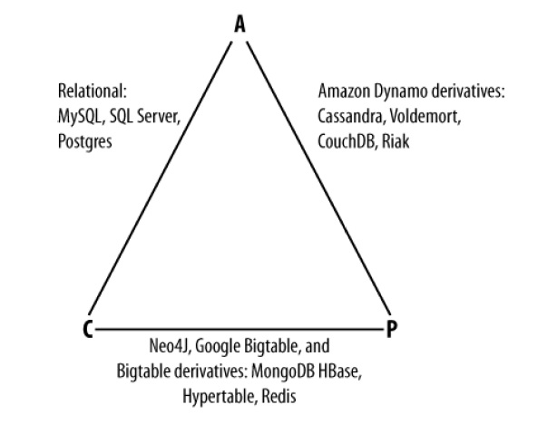

## Нюансы синтаксиса

### Последовательность выполнения команд
```sql
SELECT
customers.name,
COUNT(order_id) as Total_orders,
SUM(order_amount) as total_spent
FROM customers
JOIN orders ON customers.id = orders.customer_id
WHERE order_date >= '2023-01-01'
GROUP BY customers.name
HAVING total_spent >= 1000
ORDER BY customers.name
LIMIT 100;

1 - FROM clause
2 - ON clause
3 - JOIN clause
4 - WHERE clause
5 - GROUP BY clause
6 - HAVING clause
7 - SELECT clause (WINDOW FUNCTIONS HAPPENS HERE!!!!!)
8 - DISTINCT
9 - ORDER BY clause
10 - LIMIT clause / or TOP clause
```

### Создается ли индекс для pk автоматически?
- да
- PostgreSQL автоматически создаёт индекс для каждого уникального ограничения и ограничения первичного ключа (unique constraint and primary key constraint), чтобы обеспечить уникальность. 
- Таким образом, нет необходимости явно создавать индекс для столбцов первичного ключа.

### Having vs Where

- **WHERE**: Используется для фильтрации строк **до выполнения агрегатных функций и группировки**.
```sql
SELECT * FROM table
  WHERE condition;
```
- **HAVING**: Используется для фильтрации групп **после агрегации**.
```sql
SELECT column1, COUNT(*)
  FROM table
  GROUP BY column1
  HAVING COUNT(*) > 1;
```

### Join vs Union

#### Join
1. INNER JOIN: Возвращает строки, у которых есть совпадения в обеих таблицах.
```sql
SELECT *
   FROM table1
   INNER JOIN table2 ON table1.id = table2.id;
```
2. LEFT JOIN (LEFT OUTER JOIN): Возвращает все строки из левой таблицы и соответствующие строки из правой таблицы. Если совпадений нет, то правые столбцы будут заполнены NULL.
```sql
SELECT *
   FROM table1
   LEFT JOIN table2 ON table1.id = table2.id;
```
3. RIGHT JOIN (RIGHT OUTER JOIN): Возвращает все строки из правой таблицы и соответствующие строки из левой таблицы. Если совпадений нет, то левые столбцы будут заполнены NULL.
```sql
SELECT *
   FROM table1
   RIGHT JOIN table2 ON table1.id = table2.id;
```
4. FULL JOIN (FULL OUTER JOIN): Возвращает строки, когда есть совпадения в одной из таблиц. Возвращает все строки из обеих таблиц, заполняя NULL в местах, где нет совпадений.
```sql
SELECT *
   FROM table1
   FULL JOIN table2 ON table1.id = table2.id;
```

#### Union
UNION используется для объединения результатов двух или более SELECT-запросов. Он объединяет результаты по вертикали:
1. UNION: Убирает дубликаты.
```sql
SELECT column1 FROM table1
  UNION
  SELECT column1 FROM table2;
```
2. UNION ALL: Сохраняет дубликаты.
```sql
SELECT column1 FROM table1
  UNION ALL
  SELECT column1 FROM table2;
```

### Очередность Group by и Order by
**сначала GROUP BY, потом ORDER BY**

```sql
[ WITH <common_table_expression>]
SELECT select_list [ INTO new_table ]
[ FROM table_source ] [ WHERE search_condition ]
[ GROUP BY group_by_expression ]
[ HAVING search_condition ]
[ ORDER BY order_expression [ ASC | DESC ] ]
```

### Агрегатные функции
- sum: ` SELECT SUM(column) FROM table;`
- avg: ` SELECT AVG(column) FROM table;`
- count: ` SELECT COUNT(column) FROM table;`
- max: ` SELECT MAX(column) FROM table;`
- min: ` SELECT MIN(column) FROM table;`

### Оконные функции
Оконные функции выполняются по окну (подмножеству данных) и позволяют создавать такие вычисления, как скользящее среднее, ранжирование и кумулятивные суммы.

- ROW_NUMBER(): Присваивает уникальный номер строкам в пределах каждого окна.
    ```sql
    SELECT column, ROW_NUMBER() OVER (ORDER BY column) AS row_num
       FROM table;
    ```
- RANK(): Присваивает ранг строкам в пределах окна.
    ```sql
    SELECT column, RANK() OVER (ORDER BY column) AS rank
       FROM table;
    
    ```
- DENSE_RANK(): Похож на RANK, но без пропусков в ранжировании.
    ```sql
    SELECT column, DENSE_RANK() OVER (ORDER BY column) AS dense_rank
    FROM table;
    ```
- SUM() OVER: Сумма по окну.
    ```sql
    SELECT column, SUM(column) OVER (PARTITION BY another_column) AS sum_partition
       FROM table;
    ```

## Индексы
// Что такое индекс? Зачем нужен? Может ли сделать запрос медленнее? Типы индексов в постгресе и монго + для каких операций какие нужны. Что такое btree?

Индекс — это специальная структура, которая помогает оптимизировать поиск в базах данных.
Они помогают быстро находить необходимую информацию без необходимости просматривать все данные.

## Нюансы:
1. могут замедлить операции, такие как INSERT, UPDATE, и DELETE, поскольку после изменения данных индексы должны быть пересчитаны. 
   - Также излишнее количество индексов может увеличить затраты на хранение и обслуживание.
2. Есть нюансы с Seq scan (иногда он быстрее чем индекс):
   - **Большой объём данных:** Когда нужно извлечь большой процент или все строки из таблицы, последовательное сканирование может быть быстрее, так как чтение всей таблицы целиком может иметь меньшие накладные расходы, чем переходы по индексам и выборочные чтения.
   - **Небольшие таблицы:** Для маленьких таблиц затраты на чтение всего содержимого могут быть незначительными по сравнению с затратами на использование индексов, поэтому последовательное сканирование может оказаться более эффективным.
3. Покрывающие индексы (covering) - в этом случае оптимизатор может применить исключительно индексное сканирование (Index Only Scan)
   - работает когда индекс уже содержит все необходимые для запроса данные

## Типы индексов:
- btree
  - поддерживает: Операторы линейного порядка `<, <=, =, >=, >`
  - Операторы префиксного поиска `~<~, ~<=~, ~, ~>=~, ~>~` с использованием дополнительных классов операторов
- hash
  - Индекс может содержать только одно поле 
  - поддерживает только один оператор `=`, поэтому в реальной работе малоприменим.
- gist
  - Операторы геометрических отношений `<<, &<, &>, >>, <@, @>, ~=, &&, <<|, &<|, |&>, |>>, ~, @`
  - сетевые адреса
  - числовые и хронологические диапазоны
  - при использовании расширения btree_gist поддерживает операторы и типы btree
  - мастхэв
- gin
  - массивы `&&, @>, <@, =`
  - jsonb `@>, @?, @@`
  - tsvector
- spgist
  - Индекс может содержать только одно поле и поддерживает те же возможности, что и у gist, включая оператор упорядочивания <->, но с большей оптимизацией для пространственных данных.
- brin
  - С одной стороны, позволяет эффективно индексировать большие блоки данных, с другой - неэффективен для небольших, поскольку всегда получается `Bitmap Heap Scan`.
- и тд

Из приведенных выше особенностей следует достаточно простой алгоритм, когда и какой тип можно попробовать использовать, а когда не стоит:

- поддержка нужного оператора; 
  - не стоит пытаться использовать btree-индекс, если у вас условие с <>, но если у вас ~>=~, не забудьте text_pattern_ops. 
- поддержка нужного типа; 
  - хотите что-то искать в jsonb - только gin, если надо сочетать <, =, > и <@ - смотрим на btree_gist/btree_gin.
- поддержка нескольких полей; 
  - если необходима, то hash и spgist сразу отпадают.
- количество данных; 
  - если возвращается мало записей, то brin вам не нужен.

### Способы индексации
Пример: 
```sql
explain (analyze, buffers, costs off, verbose)
SELECT oid FROM pg_class_copy WHERE relkind = 'S';
```
- Без индекса
  - explain показывает `seq scan` 
- Индекс по полю/выражению
  - `CREATE INDEX ON pg_class_copy USING btree(relkind);`
  - и explain покажет вместо `seq scan` - `index scan`
- Индекс с условием
  ```sql
    CREATE INDEX ON pg_class_copy USING btree(oid) -- индексируемое поле
    WHERE relkind = 'S';                         -- условие применения индекса
    ```
  - При таком индексе можем получить `Index Only Scan`

### Explain и Explain Analyze[[link]](https://habr.com/ru/articles/203320/)

EXPLAIN только оценивает план выполнения запроса и выводит его структуру и стоимость. Она не выполняет сам запрос, а только предоставляет информацию о том, как планировщик PostgreSQL будет выполнять запрос.
```sql
EXPLAIN SELECT * FROM foo;

QUERY PLAN
— Seq Scan on foo (cost=0.00..18334.00 rows=1000000 width=37)
(1 row)
```
- Seq Scan — последовательное, блок за блоком, чтение данных таблицы foo.
- cost - Это не время, а некое сферическое в вакууме понятие, призванное оценить затратность операции.
    - Первое значение 0.00 — затраты на получение первой строки. Второе — 18334.00 — затраты на получение всех строк.
- rows — приблизительное количество возвращаемых строк при выполнении операции Seq Scan.
    - Это значение возвращает планировщик. В моём случае оно совпадает с реальным количеством строк в таблице.
- width — средний размер одной строки в байтах.

EXPLAIN ANALYZE выполняет сам запрос и выводит его план выполнения, а также фактические статистические данные о времени выполнения и количестве возвращённых строк. Она предоставляет более точную информацию о том, как запрос выполняется на реальных данных.
```sql
EXPLAIN ANALYZE SELECT * FROM foo;

QUERY PLAN
— Seq Scan on foo (cost=0.00..18334.10 rows=1000010 width=37) (actual time=0.012..61.524 rows=1000010 loops=1)
Total runtime: 90.944 ms
(2 rows)
```
- Такой запрос будет исполняется реально.
  - В случаях когда не хочется коммитить данные используйте команду ROLLBACK
- actual time — реальное время в миллисекундах, затраченное для получения первой строки и всех строк соответственно.
- rows — реальное количество строк, полученных при Seq Scan.
- loops — сколько раз пришлось выполнить операцию Seq Scan.
- Total runtime — общее время выполнения запроса.

#### Виды запросов:
- **Seq Scan** — читается вся таблица.
- **Index Scan** — используется индекс для условий WHERE, читает таблицу при отборе строк.
- **Bitmap Index Scan** — сначала Index Scan, затем контроль выборки по таблице. Эффективно для большого количества строк.
- **Bitmap Heap Scan** —  
- **Index Only Scan** — самый быстрый. Читается только индекс.
  - при нем за данными запрос не идет в базу, а заберет данные прямо из индекса

Профилирование запросов — это процесс анализа их производительности для оптимизации. В PostgreSQL и многих других базах данных используется команда EXPLAIN ANALYZE для изучения плана выполнения запросов и оценки их эффективности.
Вот как можно интерпретировать вывод EXPLAIN ANALYZE и определить, является ли запрос медленным или быстрым, а также на что обратить внимание:
1. Total Execution Time: 
   - Этот параметр в конце вывода указывает общее время выполнения запроса. Если время кажется неоправданно длинным для задачи, это сигнал для оптимизации.
2. Cost: 
   - Это прогнозируемая СУБД стоимость выполнения узла плана. 
   - Она состоит из двух частей: начальная и конечная стоимость (например, cost=12.34..567.89). Хотя это и не реальное время, сравнение этих значений помогает понять, какие части запроса считаются "дорогими".
3. Actual Time: 
   - Показывает реальное время, затраченное на выполнение операций. Если фактическое время значительно выше предсказанного, это может указывать на проблему.
4. Rows: Сравнивает количество строк, которое система ожидала обработать, с тем, которое она действительно обработала. 
   - Значительные отклонения указывают на неточные статистики и возможное улучшение статистики столбцов.
5. Loops: Отображает число раз, которое узел плана выполнялся. 
   - Высокое количество повторений может указывать на неэффективные вложенные циклы.

Красные флаги в выводе EXPLAIN:
- Sequential Scan (Seq Scan): Может указывать на то, что для столбца, по которому ведётся поиск, отсутствует индекс. Если этот вывод имеется у компактных таблиц или запросов без значительных фильтров, это нормально.
- Nested Loop: Не всегда плохо, но может становиться неэффективным при большом количестве строк. Следует обратить внимание на количество повторений.
- High Disk I/O: Если запрос требует много операций ввода-вывода, стоит проверить настройки памяти, индексы и исправить фрагментированные таблицы.
- Sort и Aggregate на больших объёмах данных: Узлы сортировки и агрегации могут быть причиной замедления. Использование индексов и упрощение запросов может помочь.

## Транзакции
// Что такое транзакция? ACID. Уровни изоляции транзакций, какие бывают. Аномалии. Блокировки.

**Транзакция в контексте баз данных — это последовательность операций, которые выполняются как единое целое.**
Основная цель транзакций — обеспечить корректность и согласованность данных в условиях конкурентного доступа и возможных сбоев.

### ACID
1. Atomicity (Атомарность): 
   - **Транзакция должна быть атомарной, то есть все её операции должны быть выполнены успешно, или ни одна из них не должна быть выполнена.** Если в ходе выполнения транзакции происходит сбой, все изменения, внесённые в базу данных, должны быть отменены.
2. Consistency (Согласованность): 
   - **Транзакция должна переводить базу данных из одного согласованного состояния в другое.** Это означает, что данные должны соответствовать всем целостным ограничениям сразу после окончания транзакции.
3. Isolation (Изолированность): 
   - **Изолированность гарантирует, что параллельно выполняющиеся транзакции не должны оказывать влияние друг на друга.** Результаты выполнения транзакции не должны быть видимы другим транзакциям до её завершения.
4. Durability (Надёжность): 
   - **Надёжность гарантирует, что после успешного завершения транзакции все её изменения сохраняются в базе данных, даже в случае сбоя системы.** Это достигается с помощью механизма журналирования или других методов.

### блокировки
#### SELECT FOR UPDATE
SELECT FOR UPDATE — это механизм блокировки, используемый в SQL для управления конкурентным доступом к данным.
- Когда выполняется запрос с использованием SELECT FOR UPDATE, все выбранные строки блокируются для других транзакций.
- Он предназначен для предотвращения "грязного" чтения или записи одних и тех же данных несколькими транзакциями одновременно.

Уровни блокировок:
- Строковые блокировки (Row-Level Locks):
  В основном управляются механизмами транзакционной изоляции, такие как FOR UPDATE или SELECT FOR SHARE, для защиты конкретных строк с минимальным вмешательством в другие доступы.
- Блокировки таблицы (Table-Level Locks):
  Используются для предотвращения структурных изменений, например, при изменении схемы таблицы с помощью ALTER TABLE. Они редко применяются за пределами изменений схемы.
- Блокировки базы данных (Database-Level Locks):
  Обычно применяются при выполнении глобальных операций, таких как резервное копирование или восстановление, и это не является частью обычного процесса управления транзакциями.

### Аномалии транзакций
1. Грязное чтение (Dirty Read)
    - Описание: Транзакция читает изменения, сделанные другой транзакцией, которая еще не была зафиксирована. Если эта другая транзакция откатится (ROLLBACK), прочитанные данные окажутся неконсистентными.
    - Уровни изоляции: Эта аномалия предотвращается на уровне изоляции Read Committed и выше. В PostgreSQL Read Uncommitted не используется, всегда применяется как минимум Read Committed.
2. Неповторяющееся чтение (Non-Repeatable Read)
    - Описание: Одна транзакция читает те же данные несколько раз, но получает разные результаты между чтениями, поскольку другая транзакция изменила и зафиксировала эти данные в промежутке.
    - Уровни изоляции: Эта аномалия предотвращается на уровне Repeatable Read и Serializable.
3. Фантомное чтение (Phantom Read)
    - Описание: Транзакция повторно выполняет запрос, который возвращает набор строк, но при повторном выполнении того же запроса набор строк изменяется (например, из-за того что другая транзакция добавила или удалила строки).
    - Уровни изоляции: Эта аномалия предотвращается на уровне Serializable.

### Уровни изоляции
1. Read Uncommited
   - Грязные чтения обычно разрешены на этом уровне
2. Read Committed: 
   - Каждый запрос видит только данные, которые были зафиксированы до начала запроса.
   - Предотвращает грязные чтения. От каждое чтение данных использует последнее зафиксированное значение, но неповторяющееся и фантомные чтения могут возникать.
   - Не накладывает явных блокировок на уровне строк для операций чтения.
   - в PostgreSQL Read Committed является уровнем по умолчанию
3. Repeatable Read: 
   - Гарантирует, что данные, прочитанные в начале транзакции, будут оставаться неизменными для этой транзакции, предотвращая таким образом грязные и неповторяющиеся чтения. Но фантомные чтения все еще возможны.
   - Использует механизм многоверсионности и устанавливает снимок данных на начало транзакции, что предотвращает неповторяющиеся чтения.
   - Читатели не блокируют других читателей; писатели могут блокировать другие операции на уровне строк при конфликте.
   - Чтение видит только те данные, которые были зафиксированы на момент начала транзакции.
4. Serializable: 
   - Обеспечивает полное предотвращение всех вышеуказанных аномалий, включая фантомные чтения. Это самый строгий уровень изоляции и имитирует сериальную (последовательную) видимость транзакций.
   - используется, когда требуется максимальная целостность данных, несмотря на возможные потери в производительности.
   - Использует MVCC и блокировки для обеспечения отсутствия аномалий транзакций.
   - Могут возникать блокировки более высокого уровня, иногда требуются блокировки всей таблицы для предотвращения фантомных вставок.

#### Оптимистичные и пессимистичные блокировки
Оптимистичные и пессимистичные блокировки — это два подхода к управлению конкурентным доступом к данным в многопользовательских средах, таких как базы данных

Оптимистичная блокировка основывается на предположении, что конфликты при доступе к данным случаются редко. Она позволяет выполнять операции до самого последнего момента и только затем проверяет, произошли ли изменения, которые могут повлиять на результаты.
- Процесс:
  1. Клиент считывает данные и запоминает некое значение, представляющее состояние данных (например, метка времени или версия).
  2. Клиент модифицирует данные локально.
  3. Перед записью изменений система проверяет, не изменились ли данные с момента их чтения (например, сравнивает текущую метку времени с сохраненной).
  4. Если данные не изменились, изменения записываются. Если они изменились, операция отменяется или повторяется (например, с уведомлением пользователя).
- Плюсы:
  - Высокая производительность при редких конфликтах, так как не требуется удержание блокировок.
  - Подходит для распределенных систем и сценариев с большим количеством чтения и малым количеством записи.
- Минусы:
  - В случае частых конфликтов производительность может упасть из-за необходимости повторения операций.
  - Не всегда подходит для операций, где недопустимо повторное выполнение.

Пессимистичная блокировка предполагает, что конфликты вероятны, и использует блокировки для предотвращения изменения данных другими транзакциями в процессе их чтения и записи.
- Процесс:
  1. Клиент получает блокировку на данные перед их чтением или изменением.
  2. Пока блокировка удерживается, другие операции на этих же данных блокируются или отклоняются.
  3. По завершении изменений блокировка снимается, и другие транзакции могут получить доступ к данным.
- Плюсы:
  - Обеспечивает высокую степень защищенности от конфликтов и потери данных, так как не позволяет другим транзакциям изменять заблокированные данные.
  - Обеспечивает консистентность данных в средах с высокой конкуренцией.
- Минусы:
  - Может вызывать задержки и блокировки, если одна транзакция удерживает блокировку, а другие ждут.
  - Может снижать производительность в системах с высокой частотой чтений.

## Нормализация и нормальные формы
Нормализация — это способ организации данных. 
- В нормализованной базе нет повторяющихся данных, с ней проще работать и можно менять её структуру для разных задач. 
- В процессе нормализации данные преобразуют, чтобы они занимали меньше места, а поиск по элементам был быстрым и результативным.
- Нормальная форма — требование, предъявляемое к структуре таблиц

Нужно чтобы:
1. Уменьшает объём базы данных и экономит место.
   - За счёт отдельных таблиц для категорий и повторяющихся элементов можно уменьшить размер записей в базе данных, а значит, и её вес.
2. Упрощает поиск и делает работу с базой удобнее.
3. Уменьшает вероятность ошибок и аномалий.
   - Нормальные формы данных в таблицах взаимосвязаны.

### Формы [[link]](https://practicum.yandex.ru/blog/chto-takoe-normalizaciya-dannyh/#chto-takoe) [[link]](https://habr.com/ru/articles/254773/)
Всего их 6 + нормальная форма Бойса-Кодда + еще несколько теоретических:
**обычно дальше 3 не доходит** - дальше 4ой обычно это теоретически возможный результат, который в проде не нужен.

- **Первая нормальная форма**
  - В базе данных не должно быть дубликатов и составных данных.
  - Так нельзя:
    Фирма	Модели
    BMW	    M5, X5M, M1 
    Nissan	GT-R
  - так должно быть
    Фирма	Модели
    BMW	    M5
    BMW	    X5M
    BMW	    M1
    Nissan	GT-R
- **Вторая нормальная форма**
  - когда выполняется 1NF
  - у каждой записи в базе данных должен быть первичный ключ. 
  - Первичный ключ — это элемент записи, который не повторяется в других записях.
- **Третья нормальная форма**
  - когда выполняется 2NF
  - В записи не должно быть столбцов с неключевыми значениями, которые зависят от других неключевых значений.
    - если есть что-то лишнее, то выносим в другую таблицу
  - Если в таблице есть данные о сотрудниках, включающие столбец с именем департамента и столбец с местоположением департамента, то столбец "местоположение департамента" должен быть вынесен в отдельную таблицу, поскольку он зависит от "департамента", а не от ключа таблицы сотрудника.
- и тд

## CAP теорема
В **CAP** говорится, что в распределенной системе возможно выбрать только 2 из 3-х свойств:
- **C (consistency)** — согласованность. Каждый узел в распределенной системе должен иметь доступ к одному и тому же состоянию данных в любой момент времени.
  - Каждое чтение даст вам самую последнюю запись.
- **A (availability)** — доступность. каждый запрос, отправленный к системе, должен получить ответ, даже если произошел сбой в системе.
  - Каждый узел (не упавший) всегда успешно выполняет запросы (на чтение и запись).
- **P (partition tolerance)** — устойчивость к распределению. Система должна продолжать функционировать, даже если происходит разделение сети на две или более частей.
  - Даже если между узлами нет связи, они продолжают работать независимо друг от друга.



Проблемы CAP теоремы:
- Далёкие от реального мира определения 
- В рамках разработки, выбор в основном лежит между CP и AP 
- Множество систем — просто P 
- Чистые AP и CP системы могут быть не тем, что ожидаешь
- Многие системы — просто P

### Примеры:
#### Postgresql
- Репликация Master-Slave — одно из распространенных решений 
- Синхронизация с Master в асинхронном / синхронном режиме 
- Система транзакций использует двухфазный коммит для обеспечения consistency 
- Если возникает partition, вы не можете взаимодейстовать с системой (в основном случае)

Таким образом, система не может продолжать работу в случае partition, но обеспечивает strong consistency и availability. Это система CA!

#### MongoDB
- MongoDB обеспечивает strong consistency, потому что это система с одним Master узлом, и все записи идут по умолчанию в него.
- Автоматическая смена мастера, в случае отделения его от остальных узлов.
- В случае разделения сети, система прекратит принимать записи до тех пор, пока не убедится, что может безопасно завершить их.

Таким образом, система может продолжать работу в случае разделения сети, но теряется CAP-availability всех узлов. Это CP система!

## Как физически в постреcе происходит изменение и удаление строк (MVCC)? 
В PostgreSQL управление конкурентным доступом к данным и их версиями осуществляется через механизм, известный как многоверсионное управление конкурентным доступом (MVCC — Multi-Version Concurrency Control). MVCC позволяет каждому пользователю видеть "снимок" данных на момент начала транзакции, что предотвращает блокировки на уровне чтения и позволяет транзакциям выполняться параллельно без конфликтов.

### Изменение и удаление строк в PostgreSQL (MVCC)

1. Изменение (Update):
    - Когда строка обновляется, PostgreSQL фактически не изменяет существующую запись на месте. Вместо этого он создает новую версию строки с измененными данными.
    - Старая версия строки остается в базе данных, но помечается как "не отображается" для вновь начинающихся транзакций.
    - Это позволяет другим транзакциям продолжать доступ к старой версии строки, пока не завершатся все транзакции, начавшиеся до изменения.

2. Удаление (Delete):
    - При удалении строки PostgreSQL также не удаляет запись физически сразу. Вместо этого строка помечается как удаленная.
    - Она также продолжает существовать для транзакций, начавшихся до операции удаления, обеспечивая такой же уровень взаимодействия.

### vacuum, autovacuum
VACUUM — это процесс, очищающий старые версии строк, которые больше не видны никаким активным транзакциям. Это необходимо для освобождения пространства и предотвращения чрезмерного разрастания базы данных.

- VACUUM:
    - Должен выполняться периодически, чтобы удалять невидимые более строки, освобождая место для использования другими данными.
    - Выполняемый вручную, VACUUM может быть ресурсоемким, так как требует сканирования таблицы для выяснения, какие строки можно действительно удалить.

- AUTOVACUUM:
    - Это автоматический процесс, который встроен в PostgreSQL и запускается в фоновом режиме.
    - Автоматически определяет, когда необходимо выполнить VACUUM, на основе определенных критериев, таких как количество измененных или удаленных строк.
    - Обычно управляет поддержанием базы данных в хорошем состоянии самостоятельно, без необходимости ручного вмешательства.

AUTOVACUUM также настраивается для управления темпами и условиях выполнения, чтобы избежать влияния на производительность базы данных, используя параметры конфигурации, такие как autovacuum_vacuum_threshold, autovacuum_vacuum_scale_factor, и autovacuum_naptime.

## OLAP и OLTP
### OLTP (Online Transaction Processing)

OLTP-системы предназначены для управления краткосрочными транзакциями, которые часто включают множественные операции INSERT, UPDATE, DELETE, и обеспечение высокой скорости обработки данных. Они критически важны для приложений, которые требуют оперативной обработки транзакций, таких как системы интернет-банкинга, системы бронирования и электронная коммерция.

- Характеристики:
    - Высокая скорость обработки транзакций: Низкая задержка и высокая пропускная способность.
    - Поддержка множества однотипных транзакций: Часто тысячи транзакций в секунду.
    - Строгая нормализация данных: Помогает минимизировать дублирование и повышает целостность данных.
    - Транзакционная целостность и высокая доступность: Обеспечение ACID-свойств (атомарность, согласованность, изолированность и долговечность).

- Примеры:
    - PostgreSQL, MySQL, Oracle Database, Microsoft SQL Server. Эти системы оптимизированы для OLTP-нагрузок.

### OLAP (Online Analytical Processing)

OLAP-системы сосредоточены на выполнении сложных запросов для анализа больших объемов данных и часто используются для бизнес-аналитики и отчетности. Эти системы предназначены для поддержки принятия решений и анализа данных на более высоком уровне.

- Характеристики:
    - Оптимизировано для сложных аналитических запросов: Поддержка многомерного анализа данных.
    - Большие объемы данных: Ориентированы на анализ данных, которые накоплены за длительные периоды времени.
    - Денормализация данных: Часто данные хранятся в агрегированном или предвычисленном виде для ускорения обработки.
    - Гибкость в построении отчетов и анализа: Поддержка объединения данных из разных источников и выполнения сложных операций агрегации.

- Примеры:
    - Clickhouse, Apache Hive, Google BigQuery, Amazon Redshift, Snowflake. Эти системы и инструменты оптимизированы для OLAP-нагрузок.

### Основные различия

1. Цель:
    - OLTP: Управление и выполнение коротких транзакций, быстрое внесение изменений.
    - OLAP: Анализ данных, подготовка отчетов на основе исторических данных.
2. Структура данных:
    - OLTP: Высоко нормализованная схема (часто третья нормальная форма).
    - OLAP: Часто используетсяодномерная модель (звезда или снежинка).
3. Типы операций:
    - OLTP: Операции INSERT, UPDATE, DELETE, частые и с фокусом на целостность данных.
    - OLAP: Сложные SELECT запросы с агрегацией и вычислениями.
4. Пользователи:
    - OLTP: Взаимодействуют конечные пользователи и прикладные приложения.
    - OLAP: Аналитики, менеджеры, бизнес-пользователи.