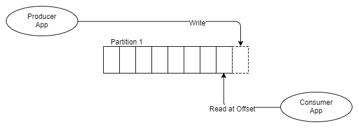

# Гарантии доставки
- **At-most-once delivery** (“как максимум однократная доставка”). 
  - Это значит, что сообщение не может быть доставлено больше одного раза. При этом сообщение может быть потеряно.
- **At-least-once delivery** (“как минимум однократная доставка”). 
  - Это значит, что сообщение никогда не будет потеряно. При этом сообщение может быть доставлено более одного раза.
- **Exactly-once delivery** (“строго однократная доставка”). 
  - Святой грааль систем сообщений. Все сообщения доставляются строго единожды.
- **No Guarantee** (таких помоему нет сейчас инструментов)

# Модели доставки
Системы очередей обычно состоят из трёх базовых компонентов:
- сервер,
- продюсеры, которые отправляют сообщения в некую именованную очередь, заранее сконфигурированную администратором на сервере,
- консьюмеры, которые считывают те же самые сообщения по мере их появления.

Консьюмеры получают данные с сервера, используя две разные модели запросов: **pull** или **push**:
- **pull** - консьюмеры сами отправляют запрос раз в n секунд на сервер для получения новой порции сообщений. (KAFKA)
  - При таком подходе клиенты могут эффективно контролировать собственную нагрузку.
  - Позволяет группировать сообщения в батчи, таким образом достигая лучшей пропускной способности.
  - Минусы:
    - потенциальная разбалансированность нагрузки между разными консьюмерами, потому что какие-то консьюмеры могут отстать от чтения
    - задержка обработки данных, потому что консьюмеры не моментально читают
- **push** - сервер делает запрос к клиенту, посылая ему новую порцию данных. (RabbitMQ или Amazon SQS)
  - снижает задержку обработки сообщений
  - позволяет эффективно балансировать распределение сообщений по консьюмерам

Как правило, приложение пишет и читает из очереди с помощью нескольких инстансов продюсеров и консьюмеров. Это позволяет эффективно распределить нагрузку.

Типичный жизненный цикл сообщений в системах очередей:
- Продюсер отправляет сообщение на сервер.
- Консьюмер фетчит сообщение и его уникальный идентификатор сервера.
- Сервер помечает сообщение как in-flight. Сообщения в таком состоянии всё ещё хранятся на сервере, но временно не - доставляются другим консьюмерам. Таймаут этого состояния контролируется специальной настройкой.
- Консьюмер обрабатывает сообщение, следуя бизнес-логике. Затем отправляет ack или nack-запрос обратно на сервер, используя уникальный идентификатор, полученный ранее — тем самым либо подтверждая успешную обработку сообщения, либо сигнализируя об ошибке.
- В случае успеха сообщение удаляется с сервера навсегда. В случае ошибки или таймаута состояния in-flight сообщение доставляется консьюмеру для повторной обработки.

# Kafka (аналог logbroker)
Kafka - это распределенная и реплицированная очередь сообщений.

Как и сервисы обработки очередей, Kafka условно состоит из трёх компонентов:
- сервер (по-другому ещё называется брокер),
- продюсеры — они отправляют сообщения брокеру,
- консьюмеры — считывают эти сообщения, используя модель pull.

Пожалуй, фундаментальное отличие Kafka от очередей состоит в том, как сообщения хранятся на брокере и как потребляются консьюмерами.
Сообщения в Kafka не удаляются брокерами по мере их обработки консьюмерами — данные в Kafka могут храниться днями, неделями, годами. Благодаря этому одно и то же сообщение может быть обработано сколько угодно раз разными консьюмерами и в разных контекстах.

Пример

Теперь давайте посмотрим, как Kafka и системы очередей решают одну и ту же задачу. Начнём с системы очередей.
Представим, что есть некий сайт, на котором происходит регистрация пользователя. Для каждой регистрации мы должны:
- отправить письмо пользователю,
- пересчитать дневную статистику регистраций.

В случае с RabbitMQ или Amazon SQS функционал может помочь нам доставить сообщения всем сервисам одновременно. Но при необходимости подключения нового сервиса придётся конфигурировать новую очередь.

Kafka упрощает задачу. Достаточно послать сообщения всего один раз, а консьюмеры сервиса отправки сообщений и консьюмеры статистики сами считают его по мере необходимости.

Kafka также позволяет тривиально подключать новые сервисы к стриму регистрации. Например, сервис архивирования всех регистраций в S3 для последующей обработки с помощью Spark или Redshift можно добавить без дополнительного конфигурирования сервера или создания дополнительных очередей.

Кроме того, раз Kafka не удаляет данные после обработки консьюмерами, эти данные могут обрабатываться заново, как бы отматывая время назад сколько угодно раз. Это оказывается невероятно полезно для восстановления после сбоев и, например, верификации кода новых консьюмеров. В случае с RabbitMQ пришлось бы записывать все данные заново, при этом, скорее всего, в отдельную очередь, чтобы не сломать уже имеющихся клиентов.

## Основные понятия

### Topic
Поток сообщений, который является частью определенной категории или названия канала, называется топиком Kafka. Producer записывают свои данные в топик, а consumer читает данные из этого топика.

На самом деле представляет собой лишь логический блок(абстракцию), которую мы используем для определения куда писать или откуда читать данные. Фактически данные хранятся в партициях.

### Broker
Кластер Kafka состоит из одного или нескольких серверов, известных как брокеры. В Kafka брокер работает как контейнер, который может содержать несколько топиков с разными partitions. Уникальный ID используется для идентификации брокера в кластере Kafka. Подключение к любому из брокеров Kafka в кластере подразумевает подключение ко всему кластеру

### Producer
Producers в Kafka публикует сообщения в одном или нескольких топиков. Они отправляют данные в кластер Kafka

### Consumer and Consumer Group
Consumers читает данные из кластера Kafka. Данные, которые должны быть прочитаны Consumers, получаются от брокера. 
Consumer group в Kafka объединяет несколько consumers, таким образом, что каждый consumer читает часть сообщений определенного топика

### Partition
Топик в Kafka разделен на настраиваемое количество частей, которые называются partitions. Partition разделяет топик по нескольким брокерам, таким образом снижая нагрузку на каждый отдельный сервер. Consumers могут быть объединены в consumer group, и тогда один сonsumer может получать сообщения не из всего топика, а только из некоторых его partitions, что обеспечивает распределение нагрузки на обработку сообщений

### Partition Offset
Сообщения или записи в Kafka относятся к partition, каждой записи присваивается число - offset, чтобы определить положение в partition. Запись идентифицируется в своем partition с помощью значения offset. Offset partition имеет значение только для этого конкретного partition. Для старых записей будут меньшие значения offset, поскольку записи добавляются в конец partition

### Replicas
Реплики похожи на резервную копию partition в Kafka. Используется для предотвращения потери данных в случае сбоя или планового отключения и размещаются на нескольких серверах в кластере Kafka

## Zookeeper
Важный компонент кластера Kafka — Apache ZooKeeper.

ZooKeeper выполняет роль консистентного хранилища метаданных и распределённого сервиса логов. Именно он способен сказать, живы ли ваши брокеры, какой из брокеров является контроллером (то есть брокером, отвечающим за выбор лидеров партиций), и в каком состоянии находятся лидеры партиций и их реплики.

В случае падения брокера именно в ZooKeeper контроллером будет записана информация о новых лидерах партиций. Причём с версии 1.1.0 это будет сделано асинхронно, и это важно с точки зрения скорости восстановления кластера. Самый простой способ превратить данные в тыкву — потеря информации в ZooKeeper. Тогда понять, что и откуда нужно читать, будет очень сложно.

В настоящее время ведутся активные работы по избавлению Kafka от зависимости в виде ZooKeeper, но пока он всё ещё с нами (если интересно, посмотрите на Kafka improvement proposal 500, там подробно расписан план избавления от ZooKeeper).

Важно помнить, что ZooKeeper по факту является ещё одной распределённой системой хранения данных, за которой необходимо следить, поддерживать и обновлять по мере необходимости.

Традиционно ZooKeeper раскатывается отдельно от брокеров Kafka, чтобы разделить границы возможных отказов. Помните, что падение ZooKeeper — это практически падение всего кластера Kafka. К счастью, нагрузка на ZooKeeper при нормальной работе кластера минимальна. Клиенты Kafka никогда не коннектятся к ZooKeeper напрямую.

## Нюансы
1. Уменьшить количество партиций в Kafka нельзя, а увеличить можно.
2. если консумер упал то как обработать сообщение заново 
   - просто написать в лог, если сообщение не важное, важное обработать заново через оффсет или dead latter queue
2. Что такое задержка сообщений (message lag) в Kafka и как её можно мониторить?
- Разница между сообщениями на стороне продюсера и потребителя, можно мониторить с помощью Consumer Lag Monitoring.
2. Как Kafka обрабатывает сбои продюсеров и потребителей?
- Kafka сохраняет состояние продюсеров и потребителей. Если продюсер или потребитель выходит из строя, система может восстановить процесс с последнего успешного отправленного или потребленного сообщения, благодаря смещению (offset).
3. Что такое Zookeeper и как он используется в Kafka?
- Zookeeper — это централизованный сервис для поддержки координации распределенных приложений. В Kafka он используется для управления конфигурацией кластера, обнаружения брокеров и контроля распределения партиций.
4. Как реализован механизм обратного давления (back pressure) в Kafka?
- Kafka распределяет нагрузку за счет динамического перераспределения партиций между потребителями и использует неожиданный рост задержки как сигнал о необходимости регулировки скорости потребления.
5. Какова роль Leader и Follower реплик в Kafka?
- Leader реплика управляет всеми запросами на чтение и запись, а Follower реплики копируют данные, обеспечивая отказоустойчивость.

# RabbitMQ
## Exchange
- Exchange маршрутизирует сообщения в очереди; типы включают direct, topic, fanout для разных маршрутизаций.

Какие существуют методы для управления отказами и вторичными попытками доставки в системах очередей?
  - Использование dead-letter очередей, повторные попытки, подтверждения.

Как RabbitMQ может эффективно распределять нагрузку среди нескольких потребителей?
- RabbitMQ может использовать round-robin или более сложные стратегии через exchange биндинги и маршрутизацию с учетом весов и других метрик.
