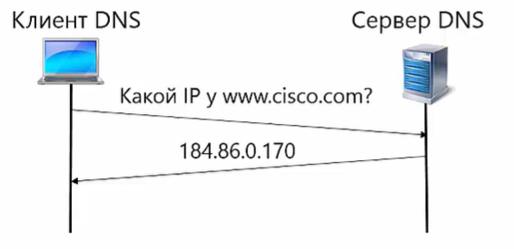

- IPV4-адреса
- IPV6-адреса(для общего развития)
- ~~маска подсети~~
- ~~URL-кодирование~~
- ограничения по памяти
- оценка алгоритмов
- ~~сигналы Linux~~
- состояния процессов ~~???~~
- ~~TCP~~
- ~~DNS~~
- ~~HTTP~~
- ~~DHCP~~
- ~~OSI/ISO~~
- задачи MEDIUM / HARD


### Определения
[Подробно](https://wiki.merionet.ru/servernye-resheniya/36/url-i-uri-v-chem-razlichie/)
- URI - Uniform Resource Identifier (унифицированный идентификатор ресурса)
- URL - Uniform Resource Locator (унифицированный определитель местонахождения ресурса)
- URN - Unifrorm Resource Name (унифицированное имя ресурса)

Конкретно:
- URI – имя и адрес ресурса в сети, включает в себя URL и URN
- URL – адрес ресурса в сети, определяет местонахождение и способ обращения к нему
- URN – имя ресурса в сети, определяет только название ресурса, но не говорит как к нему подключиться

Примеры:
- URI – https://wiki.azaza.ru/images/vse-chto-vam-nuzhno-znat-pro-devops/1.png
- URL - https://wiki.azaza.ru
- URN - images/vse-chto-vam-nuzhno-znat-pro-devops/1.png

Синтаксис URL:

`[protocol]://www.[domain_name]:[port 80]/[path or exaction resource location]?[query]#[fragment]`

### IPv4-адреса
[link](https://skillbox.ru/media/code/chto-takoe-ipadres-i-maska-podseti-i-zachem-oni-nuzhny/)
- Сетевой уровень по модели OSI
- Относится к стеку TCP/IP
- Предназначен для адресации

###### Представление адреса
IPv4 использует 32-битные (четырёхбайтные) адреса, ограничивающие адресное пространство 4 294 967 296 (232) возможными уникальными адресами.

Традиционной формой записи IPv4-адреса является запись в виде четырёх десятичных чисел (от 0 до 255), разделённых точками. Через дробь указывается длина маски подсети.
Примеры:
- Десятичная с точками	``192.0.2.235``
- Шестнадцатеричная с точками	``0xC0.0x00.0x02.0xEB``	- Каждый октет преобразуется в шестнадцатеричную форму
- Восьмеричная с точками	``0300.0000.0002.0353``	- Каждый октет преобразуется в восьмеричную форму
- Шестнадцатеричная	``0xC00002EB`` - Конкатенация октетов из шестнадцатеричной нотации с точками
- Десятичная ``3221226219``	- 32-битное число в десятичной форме
- Восьмеричная ``030000001353``	- 32-битное число в восьмеричной форме

В адресе `192.168.1.34`:
- `192.168.1` - номер сети
- `34` - номер хоста
- все устройства имеющие идентификатор `192.168.1`, находятся в одной сети


### IPV6-адреса(для общего развития)

### маска подсети

Кратко:
- [Link](https://skillbox.ru/media/code/chto-takoe-ipadres-i-maska-podseti-i-zachem-oni-nuzhny/)
- Маска подсети помогает удобно выделять из IP-адреса номер сети и номер хоста. Она выглядит как обычный IP-адрес, но на самом деле представляет собой набор последовательных единиц и нулей. Первые показывают, сколько битов занимает номер сети в IP-адресе, а второй — сколько битов принадлежит номеру хоста.
- Маски позволяют создавать подсети внутри одной сети. В этом случае подсети будут соединены одним компьютером, который похож на роутер. Он помогает хостам из разных сетей общаться между собой.

### URL-кодирование
- [Example](https://www.design-sites.ru/utility/url-encoding.php)
- [Google-notes](https://developers.google.com/maps/url-encoding?hl=ru)
- [RFC docs](https://www.rfc-editor.org/rfc/rfc3986)
- [Wiki](https://en.wikipedia.org/wiki/Query_string#URL_encoding)
- [Wiki 2](https://en.wikipedia.org/wiki/Percent-encoding)

Кратко:
- В URL некоторые символы использовать нельзя (например, пробел), а другие имеют специальное значение. По этой причине в универсальном синтаксисе URI применяется кодирование URL.
- URL, введенный в адресную строку браузера, не всегда бывает "действительным". Он может содержать специальные символы. Перед тем как выполнить переход по указанному адресу, браузер должен преобразовать эти символы в другую кодировку. Аналогичным образом, любой код, который создает или получает данные в формате UTF-8, может считать URL-адреса с символами UTF-8 "действительными", но ему также потребуется преобразовать эти символы, прежде чем отправлять их на веб-сервер.
- В URL такое кодирование обычно применяется для передачи символов в формате Unicode (как правило UTF-8) в последовательность из двух байт, записанных в шестнадцатиричном представлении. Каждый байт предваряется знаком ``%``. При таком кодировании строчка "корова" будет иметь вид: ``%D0%BA%D0%BE%D1%80%D0%BE%D0%B2%D0%B0``. То есть русской букве к будет соответствовать последовательность ``%D0%BA`` и.т.д. Такое кодирование является общепринятым для путей к файлам или папкам, входящим в URL.
- В URL можно использовать не только алфавитно-цифровые символы, но и дефис, подчеркивание. Нельзя использовать одинарные и двойные кавычки. Некоторые символы, например ``%`` или ``& ?`` используют как разделитель параметров в URL, их кодирование тогда будет неправомочным.
- Кодирование параметров может быть произвольным. Есть возможность использовать любую кодировку, если состав ее символов будет корректно передаваться через сеть. Так, вместо строки кириллицы в utf-8 можно применить строку в кодировке ``Windows 1251``. В этом случае слово "корова" будет выглядеть как ``%EA%EE%F0%EE%E2%E0``. То есть, символу ``к`` будет соответствовать последовательность из двух букв со знаком процента перед ними - ``%EA``


### ограничения по памяти

### оценка алгоритмов

### сигналы Linux
- [Статья](http://snakeproject.ru/rubric/article.php?art=linux_signals_29042020)
- [Видос](https://www.youtube.com/watch?v=ukARmoHNbOQ)
- [WIKI] (https://ru.wikipedia.org/wiki/%D0%A1%D0%B8%D0%B3%D0%BD%D0%B0%D0%BB_(Unix))
- Сигнал в операционных системах семейства Unix — асинхронное уведомление процесса о каком-либо событии, один из основных способов взаимодействия между процессами. Когда сигнал послан процессу, операционная система прерывает выполнение процесса, при этом, если процесс установил собственный обработчик сигнала, операционная система запускает этот обработчик, передав ему информацию о сигнале, если процесс не установил обработчика, то выполняется обработчик по умолчанию.

Механизм сигналов signal является простейшей формой межпроцессного взаимодействия и предназначен для внешнего управления процессами. Каждый сигнал имеет свой обработчик, определяющий поведение процесса при отсылке ему этого сигнала. Этот обработчик является некоторым набором инструкций программы (подпрограммой), которым передается управление при доставке сигнала процессу. Каждому процессу назначаются обработчики «по умолчанию», в большинстве случаев приводящие к завершению процесса.

Отдельные сигналы подразделяются на три класса:
- системные сигналы (ошибка аппаратуры, системная ошибка и т.д.);
- сигналы от устройств;
- сигналы, определенные пользователем.

Известно три варианта реакции на сигналы:
- вызов собственной функции обработки;
- игнорирование сигнала (не работает для SIGKILL);
- использование предварительно установленной функции обработки по умолчанию.

##### Утилита kill
Синтакисис:
```
$ kill [-s <сигнал>] <PID>
```

- Процесс с помощью ядра может отдать другому процессу по PID код сигнала
- Ядро передаст сигнал процессу получателю и отследит его обработку
- Сигналы могут быть кодами(числами) либо мнемоническими значениями

Перечень сигналов можно вывести командой `kill -l`:
```
$ kill -l

>>> 1) SIGHUP       2) SIGINT       3) SIGQUIT      4) SIGILL       5) SIGTRAP
6) SIGABRT      7) SIGBUS       8) SIGFPE       9) SIGKILL     10) SIGUSR1
11) SIGSEGV     12) SIGUSR2     13) SIGPIPE     14) SIGALRM     15) SIGTERM
16) SIGSTKFLT   17) SIGCHLD     18) SIGCONT     19) SIGSTOP     20) SIGTSTP
21) SIGTTIN     22) SIGTTOU     23) SIGURG      24) SIGXCPU     25) SIGXFSZ
26) SIGVTALRM   27) SIGPROF     28) SIGWINCH    29) SIGIO       30) SIGPWR
31) SIGSYS      34) SIGRTMIN    35) SIGRTMIN+1  36) SIGRTMIN+2  37) SIGRTMIN+3
38) SIGRTMIN+4  39) SIGRTMIN+5  40) SIGRTMIN+6  41) SIGRTMIN+7  42) SIGRTMIN+8
43) SIGRTMIN+9  44) SIGRTMIN+10 45) SIGRTMIN+11 46) SIGRTMIN+12 47) SIGRTMIN+13
48) SIGRTMIN+14 49) SIGRTMIN+15 50) SIGRTMAX-14 51) SIGRTMAX-13 52) SIGRTMAX-12
53) SIGRTMAX-11 54) SIGRTMAX-10 55) SIGRTMAX-9  56) SIGRTMAX-8  57) SIGRTMAX-7
58) SIGRTMAX-6  59) SIGRTMAX-5  60) SIGRTMAX-4  61) SIGRTMAX-3  62) SIGRTMAX-2
63) SIGRTMAX-1  64) SIGRTMAX
```

Особенности самых часто используемых сигналов:
- 1) ``SIGHUP`` - понимается процессами как: перечитать свои конфигурационные файлы
- 2) ``SIGINT``  - немедленно завершает процесс, можно блокировать и перехватывать
- 3) ``SIGQUIT``  - идентичен SIGTERM, позволяет сохранять дамп памяти
- 9) `SIGKILL` - не блокируется, не перехватывается, немедленно завершает процесс
- 15) ``SIGTERM`` - завершает корректно процесс, блокируется и перехватывается

Пример передачи сигнала - 9) SIGKILL:
```
$ sleep 60 &
[1] 18094

$ kill -KILL 18094

$ ps ax | grep sleep
[1]+  Killed                  sleep 60
```

##### Утилита killall
В отличие от kill - killall может посылать сигналы:
- Всем процессам с идентичными именами
- Всем процессам определенного пользователя
- Если имя сигнала не указано, передается SIGTERM

Пример передачи сигнала:
```
$ sleep 60 &
[1] 20729

$ sleep 60 &
[2] 20730

$ sleep 60 &
[3] 20731
```
Удалить все процессы с определенным именем:
```
$ killall sleep
[1]   Terminated              sleep 60
[2]-  Terminated              sleep 60
[3]+  Terminated              sleep 60
```
Удалить процессы определенного пользователя:
```
$ killall -u user_name
```

Посыл определенного сигнала:
```
$ killall -s 15 sleep
```


### Состояния процессов
- [WIKI](https://it.wikireading.ru/6567)


### OSI/ISO
- **модель OSI** - регламентирует уровни в сети и функции, выполняемые каждым уровнем
- имеет 7 уровней
- 
- Сетевое оборудование
  - 


### DHCP
- [DHCP YT](https://youtu.be/uZJ8WVdw-Ck)
- DHCP - Dynamic Host Configuration Protocol
- Особенности:
  - Позволяет назначать IP-адреса компьютерам в сети автоматически
  - Требует создания инфраструктуры (DHCP-сервер)
  - IP-адреса компьютеров могут меняться
- Клиент DHCP:
  - Компьютер, который получает IP-адрес автоматически
- Сервер DHCP:
  - Компьютер, который обеспечивает назначение IP-адресов
  - Ведет таблицу выделенных IP-адресов, чтобы избежать дублирования
  - Должен находиться в одной сети с клиентом
- Назначение IP-адреса в DHCP:
  - фиксированный 
    - для каждого MAC-адреса прописывается определенный IP, который будет выдаваться
    - очень удобно для мелких сетей
  - Динамический
    - удобен для больших сетей
    - Выдает компьютеру любой IP из пула адресов
- Пул адресов
  - список IP-адресов, которые назначает DHCP-сервер
  - DHCP-сервер следить за уникальностью распределения адресов, чтобы не было конфликтов у хостов.
  - Адрес выдается на ограниченный срок (аренда), но DHCP-сервер может продлять IP-адрес для хостов.


### DNS
- [DNS YT](https://youtu.be/B0J0c0KLtbQ)
- [Протокол DNS YT](https://youtu.be/yAlm-jTneeY)
- [Типы записей DNS YT](https://youtu.be/mvMYV0Hfig4)
- Cистема доменных имен (Domain Name System) - протокол Прикладного уровня
- DNS, позволяет определить по доменному имени IP-адрес
- использует UDP, 53 порт
- Преимущества DNS:
  - Понятные человеку имена, а не IP-адреса
  - Возможность менять сетевую инфраструктуру (менять адрес сервера, при этом сохранив доменное имя)
- Распределением доменных имен занимаются регистраторы, поэтому названия доменов строго регламентированы
- Формат пакета DNS:
  - Заголовок
  - Запрос DNS
  - Ответ DNS
  - Информация об авторитетных серверах
  - Дополнительная информация

##### nslookup (Windows)
- ```
  > nslookup www.yandex.ru
  Cервер: dc1.imm.uroran.ru
  Address: 172.19.132.29
  Не заслуживающий доверия ответ: www.yandex.ru
  Addresses: 2a02:6b8:a::a
    77.88.55.55
    77.88.55.66
    5.255.255.5
    5.255.255.55
  ```
- Другие утилиты в **Linux**:
  - host
  - dig

##### Особенности DNS
- Распределенная система
  - Нет единого сервера, на котором описываются имена хостов
- Делегирование ответственности
  - Пространство имен разделено на отдельные части - домены
  - За каждый домен отвечает отдельная организация
- Надежность
  - Дублирование серверов DNS (один вышел из строя, другой заменит)

##### Корневой домен

- Доменное Дерево
- 
  - Корневой домен
  - Домены Верхнего уровня (для организаций, для стран и т.д.)
  - Домены Второго уровня (в основном названия компаний)
  - Поддомены или адреса компьютеров Второго уровня (как с яндексом)
- Доменная Зона содержит всю информацию о последующем уровне. Ее обслуживает как один, так и множество компьютеров.

##### Еще способности DNS
- Определять для доменного имени адреса IPv4, IPv6
- Задавать несколько доменных имен для одного IP-адреса
- Находить адрес почтового сервера для домена
- Определять IP-адрес и порт некоторых сетевых сервисов
- Задавать адрес DNS-серверов для доменной зоны
- Определять по IP-адресу доменное имя


### UDP
- [YT](https://www.youtube.com/watch?v=GBrLfZvRrd8)
- UDP - протокол транспортного уровня TCP/IP (на этом же уровне TCP)
- User Datagram Protocol - не обеспечивает надежной доставки данных.
- Единица сообщение - Datagram
- UDP:
  - Нет соединения
  - Нет гарантии доставки данных
  - Нет гарантии сохранения порядка сообщений
- Преимущество UDP - скорость работы
  - нет накладных расходов на установку соединения
  - надежность (ошибку может обработать приложение)
  - в современных сетях ошибки происходят редко
- пример использования в DNS
  - система доменных имен, позволяет определить по доменному имени IP-адрес
  - ``www.cisco.com -> 184.86.0.170``
  - использует UDP, 53 порт
  - пример коммуникации 
    - 
  - если происходит ошибка, то срабатывает таймер, который ждет ответа от сервера, и если ответа нет, то заново присылает сообщение
    - 


### TCP
- [YT](https://www.youtube.com/watch?v=CKUOb4htnB4)
- [YT скользящее окно](https://www.youtube.com/watch?v=hd6QNXK5rPk)
- [YT Установление соединения](https://www.youtube.com/watch?v=vt69HEbZ_pI)
- TCP (Transmission Control Protocol) - обеспечивает:
  - гарантию доставки данных
  - порядок следования сообщений
- эталонная модель TCP/IP состоит из 4х уровней
  - 
- Протоколы данной модели:
  - 
- Процесс передачи данных:
  - установка соединения
  - передача данных
  - разрыв соединения
- Накладные расходы в TCP выше чем в UDP

##### Пример работы
- Отправитель отпарвляет сегмент данных и ждет подтверждения
- Приходит подтверждение от получателя и отправитель шлет следующий сегмент данных
- 
- Если данные не дошли, срабатывает таймер, который ждет подтверждения от получателя
- Получатель не получил данные, следовательно не отправил подтверждение
- Таймер срабатывает и шлет тот же самый сегмент данных заново 
- Получатель отсылает подтверждение и ждет следующий сегмент
- 
- Существует и нарушение порядка сообщений 
  - 
- Оно решается с помощью механизма нумерации данных. Если сегменты придут не в том порядке, то получатель сам выставит их в нужном порядке.
  - 
- Если подтверждение не пришло от получателя, то отправитель шлет сегмент еще раз, но если у получателя он уже есть, то этот сегмент игнорируется и отправляется подтверждение 
  - 

##### Установление соединения в TCP
- Соединение в TCP дуплексное (данные можно передавать в обе стороны)
- Для установления соединения шлется команда SYN и порядковый номер байта
- Получатель отправляет SYN, подтверждение получения предыдущего сообщения ACK + 1
- Отправитель шлет подтверждение получения предыдущего сообщения ACK
- После этого соединение считается установленным и можно передавать данные
- 

##### Разрыв соединения
- Корректное, одностороннее закрытие FIN
  - шлется команда FIN в обе стороны и подтверждение приходит с обеих сторон 
  - 
- Разрыв из-за критической ситуации RST
  - 


##### Скользящее окно
- Разница между Скользящим окном и обычной работой TCP
  - 
- Повышает производительность работы сети
- Размер окна - количество байтов данных, которые могут быть переданы без получаения подтверждения
- Типы подтверждения:
  - Кумулятивное
  - Выборочное


### HTTP
- [HTTP YT](https://youtu.be/RlccXUx4LVw)
- [HTTP постоянное соединение YT](https://youtu.be/7DitlqcesKI)
- [HTTP кэширование YT](https://youtu.be/esi6YZRvJzk)
- **HTTP** - _текстовый протокол_
- **HTTP (Hypertext Transfer Protocol)** - основа World Wide Web, находится на Прикладном уровне OSI
- не обязательно отображать Гипертекст(HTML), можно отображать и текст
  - ``http://important.ru/rfc/rfc959.txt``
- Использует TCP и 80 порт
- Поддерживает работу кэша.

##### Версии HTTP:
- **HTTP 0.9** - Экспериментальная версия ЦЕРН, 1991г
- **HTTP 1** - первая офф. версия протокола, 1996г
- **HTTP 1.1**, 1997г
  - добавили кэширование, keep-alive, аутентификацию
  - Используется сейчас
  - Недостатки:
    - медленный ответ сервера из-за лишних задержек
    - плохое использование ресурсов ОС
    - невозможность работы со сжатыми данными и заголовками
- **HTTP 2**, 2015
  - вводится в эксплуатацию
  - Преимущества:
    - Позволяет грамотно работать со сжатыми данными и заголовками
    - Контроль различных событий на стороне сервера
    - Контроль трафика
  - Именно поэтому этот протокол был взят за основу для gRPC.

##### Пакет HTTP
- Запрос/статус ответа
  - GET /courses/networks
  - 200 OK
- Заголовки (не обязательно)
  - Host: (Обязательно в HTTP 1.1)
  - Content-Type: text/html
  - Content-Length: 5151
- Тело сообщения (не обязательно)
  - HTML
  - JSON, XML И тд
  - иные параметры

##### Методы HTTP
- **GET** - запрос с телом сообщения
- **HEAD** - запрос без тела сообщения (только заголовок). Используется для опроса, существует ли какая-то запись.
- **POST**
- **PATCH**
- **PUT**
- **DELETE**
- **TRACE** - трассировка страницы
- **OPTIONS** - какие методы поддерживаются для определенного ресурса
- **CONNECT** - позволяет подключиться к серверу через прокси

##### Статусы ответов
- **1XX** - информационные коды
- **2XX** - успешное выполнение чего-либо
- **3XX** - перенаправление запроса - redirect (301 - постоянный, 307 - временный)
- **4XX** - ошибка на стороне клиента (обычно такие ошибки обрабатываются на сервере)
- **5XX** - Ошибка сервера (не доступен и т.д)

##### Постоянное HTTP соединение (HTTP keep-alive, HTTP persistent connection)
- Используется одно TCP-соединение для загрузки нескольких ресурсов (не закрывается)
- Преимущества:
  - не нужно тратить время на установку TCP-Соединения, если что-то еще потребуется от сервера
  - Высокая скорость передачи данных за счет использования окна большего размера в TCP
- Поддержка:
  - HTTP 1.0: Доп. заголовок ``Connection: keep-alive``
  - HTTP 1.1, 2: все соединения постоянные
  - современные высоконагруженные сервера самостоятельно закрывают соединения, чтобы не тратить ресурсы. В этом им помогают таймауты (5-15 сек.).


### задачи MEDIUM / HARD
- решать на ``leetcode.com``