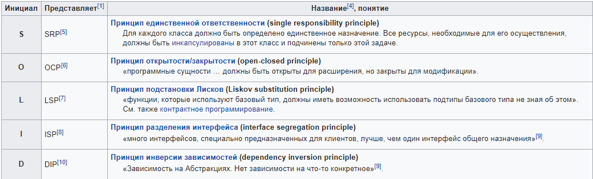

- **Принципы ООП**
  - __Наследование__ - позволяет описать новый класс на основе уже существующего (родительского), при этом свойства и функциональность родительского класса заимствуются новым классом. Другими словами, класс-наследник реализует спецификацию уже существующего класса (базовый класс). Это позволяет обращаться с объектами класса-наследника точно так же, как с объектами базового класса. Наследование бывает простое и множественное.
  - __Полиморфизм__ - возможность объектов с одинаковой спецификацией иметь различную реализацию. По-сути это переопределение поведения. Рассмотрим «человека» и «водителя» и добавим «пешехода». Человек умеет как-то передвигаться, но как именно, зависит от того, водитель он или пешеход. То есть у пешехода и водителя схожее поведение, но реализованное по-разному: один перемещается ногами, другой – на машине.
  - __Инкапсуляция__ - сокрытие поведения объекта внутри него. Позволяет пользователю не задумываться о сложности реализации используемого программного компонента (что у него внутри?), а взаимодействовать с ним посредством предоставляемого интерфейса (публичных методов и атрибутов).
  - __Абстракция__ - это придание объекту характеристик, которые отличают его от всех объектов, четко определяя его концептуальные границы

- **SOLID**

  - **Single Responsibility Principle (Принцип единственной обязанности)**. Один класс выполняет только одну работу
  - **Open-Closed Principle (Принцип открытости/закрытости)**. Программные сущности (классы, модули, функции) должно быть открыты для расширения, но не модификации.
  - **Liskov Substitution Principle (Принцип подстановки Лисков)**. Для любого класса клиент должен иметь возможность использовать любой подкласс базового класса, не замечая разницы между ними. Интерфейсы идентичны должны быть.
  - **Interface Segregation Principle (Принцип разделения интерфейсов)**. Клиенты не должны зависеть от интерфейсов, которые они не используют.
  - **Dependecy Inversion Principle (Принцип инверсии зависимостей)**. Зависимость должна быть от абстракций, а не от конкретики. Модули верхних уровней не должны зависеть от модулей нижних уровней. Классы и верхних, и нижних уровней должны зависеть от одних и тех же абстракций. Абстракции не должны зависеть от деталей. Детали должны зависеть от абстракций.
  - 

- **KISS (keep it simple, stupid)**
  - принцип проектирования, при котором простота системы декларируется в качестве основной цели или ценности.

- **DRY (don’t repeat yourself)**
  - доступ к конкретному функционалу должен быть доступен в одном месте, унифицирован и сгруппирован по какому-либо принципу, а не «разбросан» по системе в произвольных вариациях

- **YAGNI (You aren't gonna need it)**
  - возможности, которые не описаны в требованиях к системе, просто не должны реализовываться.

- **GRASP**
  - general responsibility assignment software patterns — общие шаблоны распределения ответственностей
  - [Ссылка](https://ru.wikipedia.org/wiki/GRASP)

- **ПАТТЕРНЫ ПРОЕКТИРОВАНИЯ (какие знаешь как и для чего применяются)**
  - адаптер - позволяет объектам с несовместимыми интерфейсами работать вместе
  - синглтон - позволяет создать обьект, который будет в единственном экземпляре в системе.
  - декоратор - позволяет расширить уже существующую функциональность класса.
  - цепочка обязанностей - позволяет избежать привязку отправителя к получателю. Запрос идет по цепочке, пока его кто-то не обработает.
  - наблюдатель - позволяет нотифицировать все зависящие обьекты о каких-то изменениях.
  - фасад - определяет интерфейс для более высокого уровня системы, чтобы удобнее работать с более низкими
  - фабрика - Определяет интерфейс для создания объекта, но оставляет подклассам решение о том, какой класс инстанцировать.
  - ну и слышал об:
    - стратегия
    - строитель
    - мост
    - посетитель
    - и тд.

- Паттерны микросервисной архитектуры
