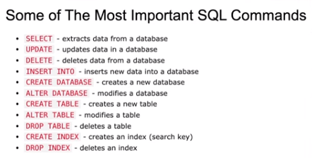

# Junior-level
**SELECT**

```sql 
SELECT city FROM Customers;
```

DISTINCT

```sql 
SELECT DISTINCT Country FROM Customers;
```

WHERE

```sql
SELECT * FROM Customers WHERE City = 'Berlin';
```

NOT

```sql
SELECT * FROM Customers WHERE NOT City = 'Berlin';
```

AND

```sql
SELECT * FROM Customers WHERE NOT City = 'Berlin' AND PostalCode = 199373;
```

OR

```sql
SELECT * FROM Customers WHERE NOT City = 'Berlin' OR City = 'DONBASS';
```

ORDER BY = ASC(В алфавитном порядке и по возрастанию по умолчанию)

Сортировка по одному полю:
```sql
SELECT * FROM Customers ORDER BY City;
```

Сортировка по нескольким полям сразу:
```sql
SELECT * FROM Customers ORDER BY Country, City;
```

DESC (В обратном алфавитном порядке и по убыванию)

```sql
SELECT * FROM Customers ORDER BY City;
```

ORDER BY (В алфавитном порядке и по возрастанию по умолчанию)

```sql
SELECT * FROM Customers ORDER BY City;
```

INSERT

```sql

INSERT INTO Customers (CustomerName, Address, City, PostalCode,Country)
VALUES ('Hekkan Burger','Gateveien 15','Sandnes','4306','Norway');
```

NULL

```sql
SELECT * FROM Customers WHERE PostalCode IS NOT NULL;
```

MIN

```sql
SELECT MIN(Price) FROM Products;
```

MAX

```sql
SELECT MAX(Price) FROM Products;
```

COUNT

```sql
SELECT COUNT(City) FROM Customers;
```

```sql
SELECT COUNT(*) FROM Products WHERE Price = 18;
```

AVG

```sql
SELECT AVG(Price) FROM Products;
```

SUM

```sql
SELECT SUM(Price) FROM Products;
```

UPDATE

```sql
UPDATE Customers SET City = 'Oslo';
```

```sql
UPDATE Customers SET City = 'Oslo', Country = 'Norway' WHERE CustomerID = 32;
```

DELETE

Удаляет конкретную запись:
```sql
DELETE FROM Customers WHERE Country = 'Norway';
```
Удаляет все записи в таблице:
```sql
DELETE FROM Customers;
```

LIKE

Выберите все записи, в которых значение столбца City начинается с буквы "а":
```sql
SELECT * FROM Customers WHERE City LIKE 'a%';
```
Заканчивается на "a":
```sql
SELECT * FROM Customers WHERE City LIKE 'a%';
```
Содержит "a":
```sql
SELECT * FROM Customers WHERE City LIKE '%a%';
```
Начинается с "а" и заканчивается на "б":
```sql
SELECT * FROM Customers WHERE City LIKE 'a%б';
```
НЕ начинаются с "а":
```sql
SELECT * FROM Customers WHERE City NOT LIKE 'a%';
```

ОПЕРАТОРЫ С LIKE

Выберите все записи, где второй буквой City является "а":
```sql
SELECT * FROM Customers WHERE City LIKE '_a%';
```

Выберите все записи, где первая буква City "a" или "c" или "s":
```sql
SELECT * FROM Customers WHERE City LIKE '[acs]%';
```

Выберите все записи, где первая буква City начинается с любой буквы от "a" до "f":
```sql
SELECT * FROM Customers WHERE City LIKE '[a-f]%';
```

Выберите все записи, в которых первая буква City не является ни "а", ни "с", ни "f":
```sql
SELECT * FROM Customers WHERE City LIKE '[^acf]%';
```

IN
```sql
SELECT * FROM Customers WHERE Country IN ('Norway', 'France');
```

BETWEEN
```sql
SELECT * FROM Customers WHERE Price BETWEEN 10 AND 20;
```

Выбирает все продукты названия которых попадают в диапазон между именами (в алфавитном порядке)
```sql
SELECT * FROM Products WHERE ProductName BETWEEN 'CHOKO' AND 'LAD';
```

AS
```sql
SELECT * FROM Customers AS CSTM;
```

GROUP BY
Перечислите количество клиентов в каждой стране, заказы стран с наибольшим количеством клиентов в первую очередь:
```sql
SELECT COUNT(CustomerID),Country FROM Customers GROUP BY Country ORDER BY COUNT(CustomerID) DESC;
```

JOIN(ALL KINDS) +-
LEFT JOIN
```sql
SELECT * FROM Orders LEFT JOIN Customers ON Orders.CustomerID=Customers.CustomerID;
```

INNER JOIN
INNER JOIN нужен, чтобы выбрать все записи из двух таблиц, в которых есть совпадение в обеих таблицах.
```sql
SELECT * FROM Orders LEFT JOIN Customers ON Orders.CustomerID=Customers.CustomerID;
```

RIGHT JOIN
RIGHT JOIN нужен, чтобы выбрать все записи из таблицы **Customers** плюс все совпадения в таблице **Orders**.
```sql
SELECT * FROM Orders RIGHT JOIN Customers ON Orders.CustomerID=Customers.CustomerID;
```

LIMIT 

OFFSET

CREATE
Создание бд с именем TEST_DB:
```sql
CREATE DATABASE TEST_DB
```

Создание новой таблицы под названием Persons
```sql
CREATE TABLE Persons (
    PersonID int,
    LastName varchar(255),
    FirstName varchar(255),
    Address varchar(255),
    City varchar(255) 
);
```

DROP
Удаление базы данных с именем TEST_DB
```sql
DROP DATABASE TEST_DB
``` 

Удаление таблицы с именем Persons
```sql
DROP DATABASE Persons
``` 

TRUNCATE
TRUNCATE TABLE - для удаление всех данных внутри таблицы
```sql
TRUNCATE TABLE Persons;
``` 

ALTER TABLE
Инструкция ALTER TABLE используется для добавления, удаления или изменения столбцов в существующей таблице.
Добавление нового столбца:
```sql
ALTER TABLE Customers ADD Email varchar(255);
```

Удаление столбца:
```sql
ALTER TABLE Customers DROP COLUMN Email;
```

Модификация столбца:
```sql
ALTER TABLE table_name ALTER COLUMN column_name datatype;
```

# Middle-level

AGGREGATION FUNCTIONS

HAVING

DELETE

DIFFERENCE BETWEEN RELATION DBs AND NoSQL

ACID

TRANSACTIONS AND PROBLEMS OF TRANSACTIONS

INDEX

AWARE OF DB SCHEMA

RELATIONS (ALL KINDS)

DATA UPDATE ON MIGRATIONS

WINDOW FUNCTIONS