#Тестирование

##Виды тестирования
1. **Static Analysis** - mypy, flake8 тд
2. **Unit** - тестирование классов, функций, фиксация кода. Внешние вызовы мокаются
3. **Integration** - тестирование интеграции с различными сервисами, микросервисами и тд.
4. **E2E** - тестирование  с вызовом допустим начиная с **_request-FE-BE-DB-BE-FE-result_**. Эмуляция сценария запускаемого пользователем

- 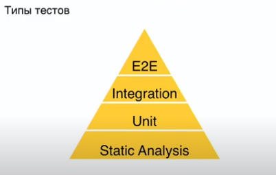
- чем выше в пирамиде вид тестирования , тем сложнее писать тесты

## Линтеры, форматтеры, тайпинги

###Линтеры
1. **pep8** (pycodestyle - новое название) - самый простой линтер
2. **flake8** - оптимальный выбор. огромное количество плагинов имеет: от докстрингов, до 
3. **pylint** - более серьезная вещь, больше ошибок ищет чем flake8, но зачастую хватает flake8.

###Форматтеры
**Black** - автоматическое форматирование кода, по pep8 и выставленным правилам в конфигурационном файле

###Статические анализаторы
**mypy** - статический анализатор, проверяющий код на соответствие типам возвращаемых в функциях, методах, в параметрах и тд.
Работает только с тайпингами. Конфигурируется реагирование на различные ошибки, игнорирование проверки каких то модулей и файлов.


## Unit тесты
- проверяются отдельные модули/классы/функции

### Pytest
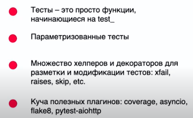

pytest парсит исходный код тестов и подменяет вызов assert в тестах на подходящую функцию, которая добавляет возможность интроспекции.

#### pytest: raises, xfail, skipif

- `raises` - отвечает за отлавливание ошибок в тесте - отловил, значит тест прошёл
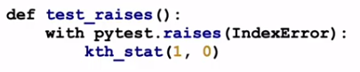
- `xfail` - позволяет пометить тест, что он сломан. помечают когда чинить долго и дорого / функциональность не используется сейчас
на тестовый сценарий влиять не будет. 
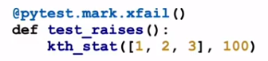
- `skipif` - позволяет какой то тест пропустить. Можно указать условие когда пропустится. Я часто использую если под какой причине тест не работает на какой то системе (Windows например)
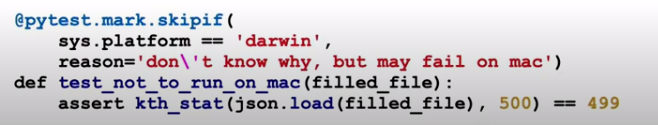

#### Pytest: полезные флаги
- `--collect-only` - вывод списка найденных тестов
- `-k` - фильтрация по имени теста
- `-s` - включает вывод stdout & stderr тестов (по-умолчанию по выводятся только для упавших тестов)
- `-v` - повышает детализацию процесса запуска тестов
- `--lf`, `--last-failed` - перезапускает тесты, упавшие при последнем запуске
- `--sw`, `--stepwise` - выходит при падении и при последующих запусках продолжает с последнего упавшего теста.

From pytest-django:
- `--create-db` - принудительное повторное создание тестовой базы данных
- `--reuse-db` - повторное использование тестовой базы данных между тестовыми запусками
- `--no-migrations` - Отключить Django миграции

#### fixtures
Фикстура - функции и методы, которые запускаются для создания соответствующего окружения для теста.
1 Пример фикстуры в которой выполняется блок кода до yield, затем yield и выполняется тест, после yield - после теста
```python
@pytest.fixture()
def connection():
    connection.create()
    yeild
    connection.close()
```
2`scope` регулирует уровень доступа фикстуры. В данном случае вызывается и отрабатывает 1 раз при запуске тестов на целый модуль.
```python
@pytest.fixture(scope='module')
def call_me_once():
    print('call me once')
```
3`autouse` вызывается в любом случае, если даже явно не указывать ее в параметрах теста и не вызывать
```python
@pytest.fixture(autouse=True)
def call_me_everywhere():
    print('call me everywhere')
```

- наследование фикстур - важная вещь, чтобы не дублировать участки кода. 
Принято декомпозировать логику, чтобы избежать фикстур в 100 строк кода к примеру.
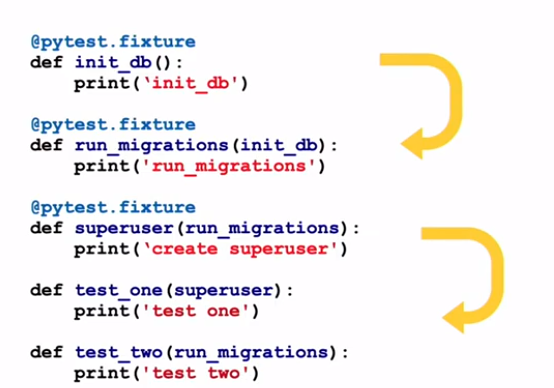

- `conftest.py` - файлик, откуда фикстура может подтягиваться без импорта явного. Принято фикстуры держать там, которые надо переиспользовать в нескольких тестах и в разных модулях.
- `pytest.ini` - основной конфигурационный файл, в котором можно изменять поведение pytest по-умолчанию
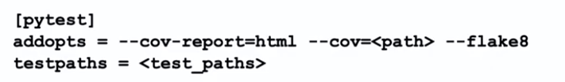
- `pytest-coverage` плагин показывающий % покрытия тестами код проекта

#### parametrize
Пример:
```python
@pytest.mark.parametrize('value', [-2, '23', 7, -231])
def test_positive_float_error(value):
    cls = PositiveFloatTesting()
    with pytest.raises(ValueError):
        cls.var = value
```
- **нельзя так делать**
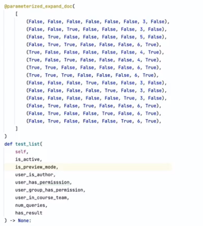
- есть еще библиотека hypothesis - параметризация для ленивых.


## Интеграционные тесты

### unittest.mock
Иногда необходимо изолировать часть программы, для того чтобы тестировать только минимально возможную часть системы,
для этого можно использовать специальные объекты подменяющие внешние объекты или функции

`unittest.mock` - это набор универсальных объектов для таких подмен.

#### Mock
`Mock` - специальный объект, на любой вызов, обращение к методам или свойствам возвращающий новый объект `Mock`
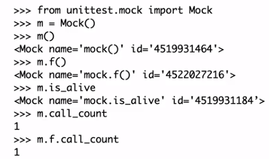

Пример:
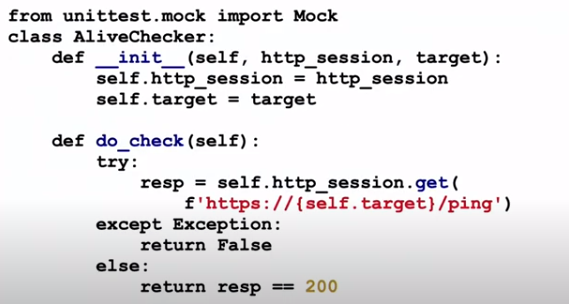
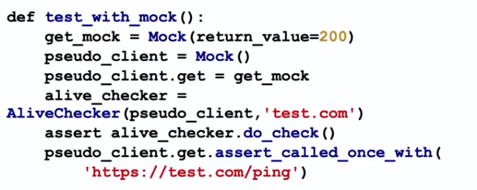
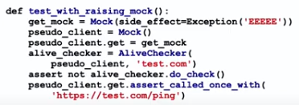

#### patch
`patch` - позволяет подменить поведение конкретной части кода

Тут в примере патчим запуск Celery таски. И чтобы не ждать время пока она запустится и отработает - проверяем наличие того что она была запущена с определенными параметрами.
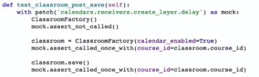
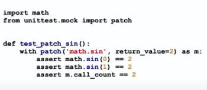

#### freezegun
`freezegun` - библиотека, позволяющая заморозить время в тесте, чтобы исключить рандомность в тесте.
Параметрами можно настроить от времени с датой до таймзоны, что надо зафикировать в конкретном тесте.
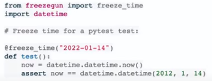

#### vcr
`vcr` - mock внешних http-запросов

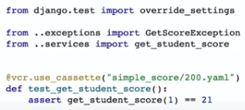

При первом запуске теста ответ сохраняется в определенный `.yaml` файл. При повторных запусках теста ответ берется и подставляется из существующего файла.


#### snapshottest
`snapshottest` - библиотека позволяющая зафиксировать отрендеренный html. 

При первом запуске теста снимок загружается в определенный `.html` файл в директории `snapshots`. При повторных запусках теста ответ сравнивается в содержимым существующего файла.

#### factory-boy и faker 
Помогают генерировать данные для тестов, фабрики заменяющие реальные объекты.

## End-to-End тесты
- Тест всегда покрывает какой-то реальный сценарий использования. По-простому эмулируют поведение пользователя. 
Допустим выкладывание фото пользователем через UI - затем в бэк запрос уходит - кладет в бд - и обратно пока не покажет пользователю, что фотка загружена.

## Другие виды тестов
- `Smoke` - для минимальной функциональности сервиса, чтобы проверить запускается ли он вообще. 
Позволяет поднять и запустить сервис и проверить его на работоспособность(могут быть баги и ошибки не в важном коде для системы в целом).
- `Regression` - позволяют проверить работоспособность старой функциональности при наличии новой.
- `Compatibility` - проверка совместимости.
- `Installation` - проверка установки и инсталляции приложения / программы
- `Acceptance`
- `Alpha`
- `Beta`
- `Performance` - нагрузочное тестирование 
- `Stress` - нагрузочное тестирование 

## Полезные мысли
- не мокать весь сервис - растет процент ложноотрицательных тестов
- не писать тесты завязанные на сеть или рандом - повышается процент ложноположительных тестов
- не гнаться за 100% покрытием тестов
- в новой компании/команде, в коде которой нет тестов - начните добавлять по мере написания новой функциональности и появления багов
Не нужно бросаться писать тесты на все подряд.
- тест проверяет и фиксирует либо отдельный метод (unit, интеграционный), либо целый сценарий (e2e)
- проверять количество обращений к бд/сервису, чтобы отлавливать лишние запросы и вызовы.
- если в фун-ии есть много ифов и ситуаций, с помощью параметризации надо зайти в каждый
- тестировать код на максимально реалистичном сценарии (включать логгирование, кэширование, поднимать все вспомогательные сервисы и тд), приближайте его к продовому.
- разбитие тестов по группам (по тестируемым модулям или файлам), чтобы не было каши.
- `./requirements/` иерахичен `base.txt` для прода, потом от этого наследуется и файл для CI и тестирования, и файл для dev окружения.
##TDD (test driven development)
Методология разработки ПО при которой сначала пишется тест, а потом логику. Итеративная вещь. Пишем логику до тех пор, пока тесты не пройдут, запуская на каждый момент, когда что-то новое добавили в код.